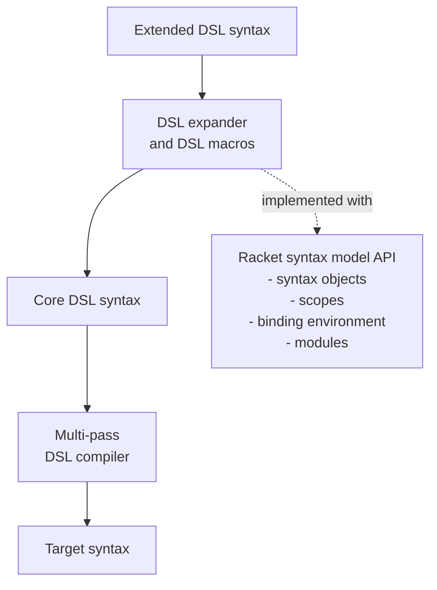

# Macros for Domain-Specific Languages

Michael Ballantyne, Alexis King, and Matthias Felleisen

PLT @ Northeastern University, USA; Northwestern University, USA

> Converted from PDF.

## Abstract

Macros provide a powerful means of extending languages. They have proven useful in both general-purpose and domain-specific programming contexts. This paper presents an architecture for implementing macro-extensible DSLs on top of macro-extensible host languages. The macro expanders of these DSLs inherit the syntax system, hygienic expansion, and more from the host. They transform the extensible DSL syntax into a DSL core language. This arrangement has several important consequences. It becomes straightforward to integrate the syntax of various DSLs and the host language when their expanders share these inherited components. Also, a DSL compiler may be designed around a fixed core language, even for an extensible DSL. Finally, macros empower programmers to safely grow DSLs on their own and tailor them to their needs.

**CCS Concepts: • Software and its engineering → Macro languages; Domain specific languages.**

**Additional Key Words and Phrases: macros, hygiene, extensible domain specific languages**

**ACM Reference Format:**

Michael Ballantyne, Alexis King, and Matthias Felleisen. 2020. Macros for Domain-Specific Languages. Proc. ACM Program. Lang. 4, OOPSLA, Article 229 (November 2020), 29 pages. https://doi.org/10.1145/3428297

## 1. Inheriting Extensibility

Macros have been used for nearly sixty years as an extension mechanism for programming languages. Though some such extensions are little more than convenient syntactic abbreviations, others implement entire domain-specific languages (DSLs). For example, the Racket match macro extends the grammar of expressions with a pattern matching DSL:

```racket
(match (list 1 2 3) [(list a _ b) (+ a b)]) ;=> 4
```

This implementation technique benefits both language authors and language users:

1. It simplifies the Racket compiler, which need only provide efficient compilation for a small core language comprising essential constructs like define and lambda.

2. It empowers users to add features the compiler authors did not have the foresight to implement. This is especially important for DSLs, which do not belong in the core language at all.

Though match is implemented as a macro, its pattern language is quite rich. Consequently, match’s implementation resembles a miniature compiler, complete with parser, intermediate representation, optimizer, and code generator. It is not hard to imagine that the aforementioned benefits of extensibility could apply just as well to match’s pattern language as they do to Racket.[^1] For example, a programmer might wish to use CSS selectors to match nodes in an HTML document:

```racket
(match (read-html "in.html") [(css .content p es) (map element-text es)])
```

Authors’ addresses: Michael Ballantyne, PLT @ Northeastern University, USA, mballantyne@ccs.neu.edu; Alexis King, Northwestern University, USA, lexi.lambda@gmail.com; Matthias Felleisen, PLT @ Northeastern University, USA, matthias@ccs.neu.edu.

This work is licensed under a Creative Commons Attribution 4.0 International License. © 2020 Copyright held by the owner/author(s). 2475-1421/2020/11-ART229 https://doi.org/10.1145/3428297

<!-- Page 2 -->

Surprisingly, existing macro systems do not provide any mechanism for DSLs, such as match, to inherit the extensibility of their host language. The draw of macro-extensibility leads some DSL authors to instead emulate the host macro system, equipping their DSLs with ad-hoc extensibility mechanisms. Because they reimplement rather than reuse extensibility features, such emulations are complex and do not cooperate with advanced features of the host macro system, such as hygiene [Dybvig et al. 1993; Flatt 2016; Kohlbecker et al. 1986], modules with reliable separate compilation [Flatt 2002], and protocols for IDE integration [Findler et al. 2002].



**Figure 1. Extensible DSL implementation architecture**

This paper presents the first architecture that allows DSLs to inherit the macro-extensibility of their host language with all of the associated advantages (sec. 3). Figure 1 illustrates the architecture with a diagram. An extensible DSL is equipped with a custom macro expander that maps terms in the DSL’s surface syntax to fully-expanded terms of a DSL-specific core language. From there, the DSL implementation employs a traditional compiler architecture with passes for static analysis, optimization, and code generation. The target language may be the host language (e.g. Racket) or another DSL. The key novelty is an API that enables DSL authors to reuse essential pieces of the host language macro expander: its syntax representation, its scoping model, its binding environment, and its module system (sec. 7). Broadly, the API offers DSL authors two concrete advantages:

1. The DSL’s author need not worry about the low-level subtleties of hygienic macro expansion and can focus entirely on the DSL grammar, scoping rules, and static semantics.

2. Because all such DSLs share a common understanding of scope and names, they naturally cooperate with the host language and with each other.

We have realized this architecture in Racket. Using our new API, Racket programmers implement DSL expanders and compilers as compile-time Racket code packaged as “languages as libraries” [Tobin-Hochstadt et al. 2011]. To guide DSL implementors, we provide a recipe that shows how to turn a DSL design into an expander implementation (sec. 6).

The remainder of this paper illustrates the implementation of DSL macro expanders using a Parsing Expression Grammars (PEG) DSL (sec. 4-5) and shows how DSL extensibility enables towers of DSLs and syntactic integration between DSLs and other program components (sec. 8). The evaluation section (9) presents revisions to four existing extensible DSL implementations to take advantage of our API.

## 2. Background: Macros and Hosted DSLs in Racket

Our work builds on the idea of using procedural macros to create and integrate DSLs. Procedural macros originated with Lisp in the 1960s and are now found in modern languages such as Clojure, Elixir, Julia, Rust, and Scala. The word macro refers to a syntactic form defined via rewriting to

<!-- Page 3 -->

other syntactic forms. Procedural macro systems allow programmers to use arbitrary host-language code to define these rewritings. At compile-time, a macro expander traverses the program and iteratively applies applicable rewritings until all syntax has been expanded to the core language. This section introduces Racket’s macros, the basics of its macro expander, and the kind of macro-based, extensible DSLs we imagine. In particular, we highlight the features that such DSLs should inherit.

### 2.1 Macros in Racket

In Racket, programmers define macros using define-syntax:

```racket
(define-syntax <racket-id> <racket-exp>)
```

The expression on the right is evaluated at compile time to obtain a transformer procedure, which the macro expander associates with the macro name on the left in a compile-time environment. Transformer procedures receive syntax objects--S-expressions enhanced with scope (and other) information--representing uses of macros and return syntax objects representing their expansions. When the expander encounters a syntax object beginning with <racket-id>, it applies the transformer procedure and resumes the expansion process with the replacement syntax.

```racket
 1   #lang racket                                                                             match-list.rkt
 2   (provide match-list)
 3   (require (for-syntax syntax/parse))
 4

 5   (define (match-list-error) (error 'match-list "expected a pair or empty list"))
 6
 7   (define-syntax match-list
 8     (lambda (stx)
 9       (syntax-parse stx
10         [(_ e:expr [() null-body ...+] [(a:id d:id) pair-body ...+])
11          #'(let ([v e])
12              (cond [(null? v) null-body ...]
13                    [(pair? v) (let ([a (car v)] [d (cdr v)]) pair-body ...)]
14                    [else (match-list-error)]))])))

 1   #lang racket                                                                                 example.rkt
 2   (require "match-list.rkt")
 3   (define (append l1 l2)
 4     (match-list l1
 5       [() l2]
 6       [(head rest) (cons head (append rest l2))]))
```

**Figure 2. A simple pattern matching macro**

Figure 2 defines a sample macro for pattern-matching lists in match-list.rkt and a module example.rkt that imports the macro and uses it. Transformer procedures may use the full Racket language, including previously defined language extensions and DSLs. The match-list transformer uses the syntax-parse DSL, which provides a declarative syntax transformation system. Simple macros such as match-list are usually written declaratively, but syntax-parse also allows more sophisticated macros to mix procedural and declarative code.

<!-- Page 4 -->

The pattern on line 10 looks much like a use of the macro. Actual subexpressions are represented by pattern variables that are annotated with syntax classes such as expr and id. These syntax classes indicate that these positions must contain Racket expressions and identifiers, respectively. The ...+ ellipses indicate that one instance or more of the preceding pattern are expected. Together these annotations allow syntax-parse to automatically issue descriptive syntax errors. The template on lines 11-14, introduced by #', combines literal syntax and syntax bound to pattern variables into the replacement syntax. Ellipses in the template replicate the preceding portion of the template once for each value in the sequence bound by corresponding pattern variables with ellipses.

**Macros that Work Together.** Racket’s macro system allows macros to cooperate in order to implement extensions that go beyond syntactic shorthands. For example, Racket’s web server language [McCarthy 2010] implements serializable continuations by transforming servlet code. Racket’s extensibility means that such transformations cannot directly process surface syntax. Instead, they must first apply the expander to eliminate all uses of syntax extensions, and then transform the core language code. Racket’s local-expand API allows macros to reflectively invoke the expander for this purpose.

Other language extensions require the exchange of static information among macros. In support of this need, Racket’s define-syntax may associate compile-time identifiers with arbitrary data and macros may retrieve this data as needed. For example, match needs to know the field names that a struct definition introduces so that it can validate struct patterns; hence, the latter macro deposits the list of names in the compile-time environment for use by the former.

Reliable macros. Two key features of Racket’s macro system ensure that macros work reliably: hygiene and phases. A macro transformation demands mutual substitution of syntax from the definition-site and use-site of the macro. The use of naive substitution would not preserve lexical scoping. Instead, Racket uses the “sets of scopes” model [Flatt 2016], which preserves lexical scope through macro transformations. Consider this use of match-list:

```racket
(let ([v #t] [match-list-error #f])
  (match-list l [() match-list-error] [(first rest) v]))
```

It naively expands to:

```racket
(let ([v #t] [match-list-error #f])
  (let ([v l])
    (cond [(null? v) match-list-error]
          [(pair? v) (let ([a (car v)] [d (cdr v)]) v)]
          [else (match-list-error)])))
```

The temporary variable v introduced by the macro appears to capture the reference v from the use-site, and the use-site binding of match-list-error appears to capture the reference to the helper procedure defined in match-list.rkt. Hygienic expansion automatically ensures that the references refer to the intended bindings.

**Phases.** Expansion requires evaluating transformer code. Racket is careful to isolate this compile-time evaluation from run-time evaluation via phase separation. Different phases cannot share bindings or values, which ensures that separate compilation works reliably [Flatt 2002]. Programs can import libraries for use in compile-time code using the for-syntax form of require, as in line 3 of figure 2, and define compile-time code locally within begin-for-syntax blocks.

<!-- Page 5 -->

### 2.2 Racket’s Macro Expander

Racket programs are first processed by the reader, which parses parenthetical structure, symbols, and literals to produce a syntax object. The macro expander implements the remainder of the language’s front-end and module system. It accepts modules that define and use macros, and produces syntax in a fixed core language. The Racket compiler, debugging tools, and static analyses process only the core language.

The expander traverses syntax, records macro definitions, and expands macro applications. Because the syntax is extensible and macro definitions may shadow any name, the expander recognizes syntactic forms via the compile-time environment.

To ensure hygiene, the expander annotates syntax with scope tokens and resolves names according to the scope sets model [Flatt 2016]. At scoping forms[^2], the expander annotates the body with a unique scope. At macro uses, the expander attaches one scope to syntax from the use-site and another to syntax generated by the macro. According to the scope sets resolution rule, a reference may refer to bindings whose scope sets are a subset of the scopes attached to the reference. Among those bindings, one shadows the others when its set is a proper superset of the others’.

```racket
1    (let ([v{example.rkt, let1 } #t] [match-list-error{example.rkt, let1 } #f])
2      (let ([v{match-list.rkt, macro, let2 } l])
3        (cond [(null? v) match-list-error{example.rkt, let1 , use-site, let2 } ]
4              [(pair? v{match-list.rkt, macro, let2 } )
5                (let ([a (car v)] [d (cdr v)]) v{example.rkt, let1 , use-site, let2 , let3 } )]
6              [else (match-list-error{match-list.rkt, macro, let2 } )])))
```

**Figure 3. Scope set annotations for macro hygiene**

Figure 3 annotates the match-list example from above with set superscripts showing the scopes applied by the expander. The macro scope on the macro-introduced v (line 2) prevents it from capturing the use-site v (line 5) that lacks this scope. Similarly the use-site scope on the match-list-error binding (line 1) means it does not capture the macro-introduced reference (line 6).

### 2.3 Hosted DSLs

Full-fledged DSLs extending Racket naturally arise from the use of procedural macros; we call these hosted DSLs. An interface macro connects the DSL with Racket. It invokes a DSL compiler, written as compile-time code. This compiler parses, analyzes, and optimizes DSL syntax before it generates target-language syntax.

Figure 4 illustrates the idea with the example of Racket’s pattern matching DSL. The interface macro, match, invokes the DSL compiler, compile-pattern-matrix, to generate an optimized sequence of conditions. The macro uses define/syntax-parse to bind the clause pattern variable to the compiler’s output and integrates the conditions into a cond expression. The DSL thus exploits standard pattern-matching compilation research, such as Augustsson [1985]’s implementation, plus additional optimizations now found in OCaml [Le Fessant and Maranget 2001; Maranget 2008]. This paper is concerned specifically with hosted DSLs, but there are other styles of DSL implementation using macros. Section 10 provides a comparison.

<!-- Page 6 -->

```racket
(begin-for-syntax
  (define (compile-pattern-matrix scrutinee patterns bodies)
    #| elided |#))

(define-syntax match
  (lambda (stx)
    (syntax-parse stx
      [(_ expr [pat body] ...)
       (define body-list (syntax->list #'(body ...)))
       (define pats-list (stx-map parse-pattern #'(pat ...)))
       (define/syntax-parse (clause ...)
         (compile-pattern-matrix #'val pats-list body-list))
       #'(let ([val expr])
           (cond clause ... [else (error 'match "no clause matched")]))])))
```

**Figure 4. match interface macro and DSL compiler**

## 3. An Architecture for Extensible DSLs

This section presents an architecture for making hosted DSLs macro-extensible. The basic idea is to augment the DSL compiler’s parser with a macro expander. Because the DSL compiler runs within the context of host-language macro expansion, we can provide an API that allows the DSL expander to reuse key elements of the host macro system. This arrangement allows macro-extensible DSLs to integrate tightly with the host language and other DSLs. Nevertheless, these DSLs can provide custom syntax, scoping and binding rules, static checks, and compiler optimizations just as standard hosted DSLs do.

Each DSL requires an expander that is specific to the DSL’s syntax and static semantics. The expander is responsible for issuing syntax errors, so it must understand the core grammar of the DSL. Macro hygiene requires interleaving expansion steps with binding analysis, so the expander must understand the DSL’s scoping and binding rules. Finally, each DSL offers macro extensibility at particular points in its grammar, and may support a relationship between extensions and the DSL’s static semantics.

One concern common to all DSL expanders is management of bindings. Not only does each language need to maintain a binding table and support hygienic name resolution, this information must be shared among all languages if they are to freely intermingle. Therefore, all expanders directly reuse the binding table, representation of scoped syntax, and module system provided by the host language, just as ordinary macros do. Another concern is source-location tracking, which allows errors in expanded code to be reported in terms of the surface syntax. DSL expanders inherit source-location tracking via reuse of host-language syntax objects.

```text
Expanders:     Racket     PEG     miniKanren     Rash     command line     types     …
Common layer:  syntax, scopes, compile-time environment, module system
```

**Figure 5. A common syntax system shared by the Racket and DSL expanders**

These requirements naturally lead to the two-layered architecture shown in figure 5. A language-agnostic system of syntax, scope, binding, and modules is shared by all languages. A specialized macro expander for each language traverses the DSL syntax and creates the appropriate scopes and bindings in the shared system. The shared layer is part of the base system (outlined in black) and is reflected into Racket as an API that compile-time code (outlined in green) uses to implement DSL macro expanders. While the Racket expander is implemented using the shared layer, it must be part of the base system in order to bootstrap the other expanders.

<!-- Page 7 -->

This separation between the two layers is already partially reflected in the macro expander’s compile-time API [Flatt 2016; Flatt et al. 2012], which provides both low-level access to syntax objects and binding tables and high-level access to the Racket expander. However, the existing API focuses on macros that add individual features to Racket, and it intertwines Racket-specific elements with the language-agnostic syntax system.

We contribute a new API which is designed to support the creation of DSL-specific expanders.[^3] It completes the set of tools needed to implement DSL expanders at the right level of abstraction. The API operations support name binding, reference resolution, scoping, macro application, and phased evaluation. Together they use the set of scopes model to implement macro hygiene. Critically, the new API is language-agnostic. It does not bake-in assumptions specific to Racket’s core language.

The following sections introduce the details of our new API and architecture in the context of a running example. We return to further discuss the rationale behind our new API design and its innovations over Racket’s previous expander API in section 7.

## 4. Parsing Expression Grammars as a Hosted DSL

This section illustrates our architecture with the case study of a Parsing Expression Grammar (PEG) DSL. Ford [2004] introduced PEGs as an alternative to context free grammars that avoids ambiguity by relying on prioritized choice between alternatives. This section presents PEGs as a hosted DSL integrated with Racket. It also discusses the static semantics and optimizations offered by its DSL compiler. Finally, it extends the PEG DSL via macros.

### 4.1 PEG Syntax as an Extension to Racket

Figure 6 specifies the grammar of the PEG DSL and its interface to Racket. Figure 7 demonstrates its use with a fragment of a PEG parser for Python.[^4] The DSL can parse text from a string or tokens from a list. Here the example parses a list of tokens represented as Racket string and number values. The first line of the example imports the DSL library, making its syntax and run-time support available within the module.

Parsing requires recognizing elements from a token stream and constructing a syntax tree. In our PEG DSL the basic expressions recognize patterns of tokens such as sequences (seq), alternatives (alt), and repetition (*). Semantic actions (=>) use Racket expressions in order to construct abstract syntax as Racket data. As illustrated in figure 7, PEG non-terminals such as arith-expr are defined in Racket modules alongside Racket structures and functions such as left-associate-binops. Thus the syntax of Racket and the PEG DSL integrate in two ways: PEG non-terminal definitions live in Racket modules, and Racket expressions are embedded in PEG’s semantic actions.

<!-- Page 8 -->

```text
<racket-def> := ... | (define-peg <nonterminal-id> <peg>)        (interface macro)
<racket-exp> := ... | (parse <nonterminal-id> <racket-exp>)      (interface macro)
<terminal-literal> := <string> | (token <racket-exp>) | ...
<nonterminal-id> := <identifier>
<peg> := <nonterminal-id>                    nonterminal reference
       | eps                                 empty match
       | <terminal-literal>                  terminal
       | (seq <peg> <peg>)                   sequence
       | (alt <peg> <peg>)                   ordered choice
       | (* <peg>)                           zero or more
       | (! <peg>)                           negative lookahead
       | (: <racket-id> <peg>)               parse variable binding
       | (=> <peg> <racket-exp>)             semantic action
```

**Figure 6. PEG DSL syntax**

Name bindings are key to the interaction between the two languages. PEG non-terminal bindings may be used with require and provide of Racket’s modules to import and export PEG non-terminals alongside other Racket bindings such as those for functions. Parse variables mediate between the parts of semantic actions: PEG binding expressions (:) in the parser part bind parse variables that can be referred to in the Racket action expression. These variables contain the result of the semantic action for the corresponding PEG subexpression, or if the binding occurs nested within repetition expressions (*), the variable contains lists of results nested to the same depth. For example, the parse variable e* in figure 7 contains a list of semantic-action results from parsing all but the first subexpression of the arithmetic expression, a term.

```racket
#lang racket
(require peg)

(struct binop-ast [lhs op rhs])

(define-peg term #| elided #|)
(define-peg arith-expr
  (=> (seq (: e1 term) (* (seq (: op* (alt "+" "-")) (: e* term))))
      (left-associate-binops e1 op* e*)))

(define (left-associate-binops e1 op* e*)
  (foldl (lambda (op e base) (binop-ast base op e))
         e1 op* e*))

(parse arith-expr '(1 "+" 2 "-" 3))
;; evaluates to:
;; (binop-ast (binop-ast 1 "+" 2) "-" 3)
```

**Figure 7. Fragment of a PEG parser for Python arithmetic expressions**

Although the lexical syntax uses S-expressions, the DSL is not embedded in Racket’s syntactic forms. Instead it adds the new syntactic category of PEG expressions, and extends Racket’s definition and expression categories via the define-peg and parse interface macros, respectively. The two languages cannot be freely intermixed--writing a Racket expression where a PEG expression is expected leads to a compile-time error message describing the mistake. Similarly, PEG non-terminal

<!-- Page 9 -->

bindings belong to a separate category from Racket variable bindings, and referring to a Racket variable in a PEG expression or vice versa leads to a compile-time error.

### 4.2 PEG Static Semantics

The PEG DSL has a custom static semantics. Its DSL compiler rejects left-recursive non-terminals. Parsing with left-recursive PEGs may fail to terminate. Consider this alternate expression of the arith-expr non-terminal:

```racket
(define-peg arith-expr-leftrec
   (alt term
         (=> (seq (: e1 arith-expr-leftrec) (: op (alt "+" "-")) (: e2 term))
              (binop-ast e1 op e2))))
```

Parsing with this definition correctly accepts arithmetic expressions because the term alternative is attempted before the left recursion, but loops forever if the term alternative never matches. Without the static check it would be easy to write buggy code. Because non-terminal definitions may be mutually recursive, checking for left recursion involves a fixed point computation across all the definitions in a module. Because a parser may be composed of non-terminals defined in different modules, the left-recursion check must communicate information between separate module compilations.

Static checks are most useful to programmers when their IDE provides feedback as they type. Racket’s macro system integrates tightly with its IDE, DrRacket, and this extends to hosted DSLs. Here DrRacket uses the DSL’s static semantics to highlight the specific non-terminal references which create the left recursion, as soon as the definitions are complete.

### 4.3 PEG Compilation and Optimization

The PEG DSL’s compiler performs optimizations. For example, scannerless parsers often include non-terminals that consist of a choice among fixed character sequences, as in this definition of Python comparison operators:

```racket
(define-peg comp-op
  (alt "==" ">=" "<=" "<" ">" "!=" "in" "not" "is"))
```

Naive execution must check every alternative and backtrack as needed. A proper compiler for the PEG DSL can use binary search and a single backtrack point. Note that this optimization applies for our DSL only when parsing text, not tokens. As illustrated in section 8.2, the DSL is designed to integrate with arbitrary token representations. These may lack the operations needed to support the binary search optimization. A variety of other optimizations have been proposed in previous work on PEGs [Grimm 2004], and our approach can accommodate many of them. These optimizations rely on analyzing and transforming DSL syntax, so it is important that our architecture for extensibility allows DSL compilers to assume a fixed core language.

### 4.4 PEG Macros

Built with our architecture, the PEG DSL is naturally macro-extensible. It uses macros to implement features that are abbreviations over terms of the core language. For example, the DSL includes a (? e) expression indicating an optional element of a sequence, and it expands to (alt e eps). PEG DSL users can also define macros to create syntactic sugar for commonly-seen patterns in their parser definitions. For example, the Python grammar includes many non-terminals such as arith-expr for binary and prefix operators, structured to encode operator precedence. Thiemann and Neubauer [2008] propose using grammar macros to simplify such definitions. The binops macro captures the pattern for parsing binary operators:

<!-- Page 10 -->

```racket
(define-syntax binops
  (peg-macro
    (lambda (stx)
      (syntax-parse stx
         [(_ op-e subexpr-e)
          #'(=> (seq (: e1 subexpr-e) (* (seq (: op* op-e (: e* subexpr-e)))))
                  (left-associate-binops e1 op* e*))]))))
```

The peg-macro constructor indicates that the macro is intended to extend the PEG language. Using the macro in another context, such as a Racket expression position, results in a syntax error. Otherwise the macro is defined in just the same way as a Racket macro: as compile-time Racket code using the syntax-parse DSL. PEG expressions generated by PEG macros can contain Racket subexpressions, and macro hygiene works for cross-language bindings such as e1 and e*.

Of course, the verbose combination of define-syntax, peg-macro, lambda, and syntax-parse is boilerplate and calls for a syntactic abstraction: define-peg-syntax-parser. With it, the binops macro may be expressed more concisely as:

```racket
(define-peg-syntax-parser binops
  [(_ op-e subexpr-e)
  #'(=> (seq (: e1 subexpr-e) (* (seq (: op* op-e (: e* subexpr-e)))))
                (left-associate-binops e1 op* e*))])
```

Together with a similar macro for prefix operators, the binops macro allows for concise specification of precedence hierarchies:

```racket
(define-peg or-test
  (binops "or"
     (binops "and"
       (prefix "not"
          (binops comp-op
             expr)))))
```

The PEG DSL also provides a local-expand-peg procedure much like Racket’s local-expand procedure, which allows PEG macros to reflectively expand and then operate on PEG syntax. More elaborate extensions to the PEG DSL appear in section 8.

## 5. A Macro System for the PEG DSL

The implementation of the PEG DSL of the preceding section rests on our new architecture and syntax system API. It couples a custom DSL macro expander with a conventional compiler architecture. This section explains the PEG DSL implementation and, in parallel, introduces the key elements of our new API. For clarity, the latter are presented in shaded boxes, to set them apart from the explanation of the implementation.

DSL expanders act just like the Racket expander: they check that DSL syntax is well formed, attach scopes, create bindings, check references, and apply macro transformers. Figure 8 sketches the expander for the PEG DSL. It illustrates how these functions are realized using our new API to Racket’s syntax system.

In general, a DSL expander is structured as a collection of compile-time functions, one per syntactic category of the DSL. Each of these functions handles the core forms and extensibility points of that syntactic category. The PEG DSL comes with only one new syntactic category (peg). Its expander thus has one expand function: expand-peg. The function accepts syntax objects that represent terms in the extensible language and returns syntax objects that represent programs using only core DSL forms. Its definition may reuse the syntax-parse DSL because our architecture shares host-language syntax objects.

<!-- Page 11 -->

```racket
 1   (define-literal-forms peg-literals
 2     (: => eps seq alt * + token))
 3
 4   (begin-for-syntax
 5     (struct peg-non-terminal [])
 6     (struct peg-macro [transformer])
 7
 8     ; (-> syntax? syntax?)
 9     (define/hygienic (expand-peg stx) #:definition
10       (syntax-parse stx #:literal-sets (peg-literals)
11         [nonterm-name:id #:when (lookup #'nonterm-name peg-non-terminal?)
12          #'nonterm-name]
13         [(: var-name:id subexp:peg)
14          (define/syntax-parse subexp^ (expand-peg #'subexp))
15          (define/syntax-parse var-name^ (bind! #'var-name (racket-var)))
16          #'(: var-name^ subexp^)]
17         [(=> subexp:peg action:expr)
18          (with-scope sc
19            (define/syntax-parse subexp^ (expand-peg (add-scope #'subexp sc)))
20            (define/syntax-parse action^ (local-expand (add-scope #'action sc)))
21            #'(=> subexp^ action^))]
22
23          ;; elided cases for eps, seq, alt, *, +, token, peg-datum
24
25          [(macro-name:id rest ...) #:when (lookup #'macro-name peg-macro?)
26           (define transformer (peg-macro-transformer (lookup #'macro-name peg-macro?)))
27           (expand-peg (transformer stx))])))
```

**Figure 8. Sketch of the PEG DSL expander**

In order to produce expanded syntax, the cases for each core language form recursively expand their subexpressions and reconstruct the core form using the expanded subexpressions. The expander uses structural recursion, calling expand-peg for PEG subexpressions, and local-expand for Racket subexpressions. For example, the clause for (=> <peg> <racket-exp>) expands its PEG subexpression on line 19 and its Racket action expression on line 20. The code follows the convention of using a name such as subexp^ to refer to the expanded version of an expression subexp. The final part of each clause uses a #' template to reconstruct the core form with the expanded subexpressions.

**Recognizing Syntax.** Expand functions use syntax-parse both to identify the core form or macro application being expanded and to provide error messages for incorrect syntax. Syntax class annotations such as expr and peg help provide informative syntax errors. Definitions of these syntax classes (not shown) provide the text that syntax-parse uses to describe the expected syntax.

Like Racket users, DSL users can replace core language forms with macros by shadowing their names. This possibility complicates the task of recognizing core forms. The expander cannot simply match the symbolic name of the identifier at the head of an expression to determine whether it corresponds to a core form. Instead, it consults the compile-time environment for the binding of that identifier. This design allows core forms to be exported and imported by modules, shadowed, and renamed.

Thus, core forms must have compile-time environment bindings just as macros do. Whereas environment bindings for macros contain the transformer procedure, only the identity of bindings for core forms is meaningful; they do not contain any information.

<!-- Page 12 -->

```racket
(define-literal-forms litset-name:id (form-name:id ...+))
```

The define-literal-forms syntax defines a core form binding for each form-name. It also defines a literals set litset-name, containing the form-name identifiers. Literals sets specify names that syntax-parse should match according to their binding, rather than treat as pattern variables when they appear in patterns.

Line 1 of figure 8 uses define-literal-forms to create bindings for the PEG core forms, along with the peg-literals literals set which expand-peg uses to recognize the core forms via their environment bindings. In figure 8, the : and => symbols in the patterns for the second and third clauses match this way.

**The Compile-time Environment.** The PEG language includes bindings for parse variables, non-terminals, and PEG expression macros. Parse variables bind information for use in Racket action expressions, so they are represented as Racket variable bindings using the racket-var datatype provided by our API. Non-terminals and PEG expression macros are new kinds of bindings specific to the PEG DSL and therefore need new datatypes for their representation in the compile-time environment. Lines 5 and 6 of figure 8 define appropriate structure types. The structure types are used at compile time, so they are defined within a begin-for-syntax block.

Non-terminal bindings have no associated compile-time information, so the structure type has no fields. Macro bindings store the transformer procedure. The PEG expander creates parse variable bindings so that the Racket expander can check references in action expressions. The define-peg macro creates non-terminal bindings (sec. 5.1). DSL users create macro bindings directly, using define-syntax together with the peg-macro datatype constructor. The PEG expander checks references to non-terminals, ensuring they have a corresponding binding. The PEG expander also relies on PEG macro bindings to find the macro transformers needed for macro expansion.

```racket
(bind! name value) -> identifier?
```

The bind! procedure creates a binding with an associated value in the compile-time environment. It returns a new binding identifier for the DSL expander to use in place of the original in the fully-expanded program.

```racket
(lookup name predicate) -> (or/c #f any/c)
```

The lookup procedure looks for a binding of the given identifier in the compile-time environment. If the value stored in the compile-time environment satisfies the given predicate, the value is returned. If the name is unbound or fails to match the predicate, lookup returns #f.

Non-terminal references are checked on line 11 of figure 8. There, the expander looks up identifiers in the compile-time environment and checks that they are bound to an instance of the peg-non-terminal datatype. Parse variables are bound to an instance of the racket-var datatype in the clause for the (: <id> <peg>) binding form, on line 15.

<!-- Page 13 -->

**Implementing Scope with Scope Sets.** The (=> <peg> <racket-exp>) PEG core form exemplifies a form that introduces scope. Just like the Racket expander, the PEG expander implements scope by attaching scope objects to syntax. The sets of scopes attached to bindings and references subsequently determine how references are resolved.

```racket
(with-scope v:id body ...)
(add-scope syntax scope) -> syntax?
```

The with-scope syntax introduces a scope. It binds the identifier v to a new scope object, which should be attached to syntax objects that originate within the (conceptual) scope using the add-scope procedure. Bindings created within the with-scope body are available for reference via lookup during the body’s dynamic extent.

Line 18 of the expander creates a new scope, line 19 applies the scope to the PEG subexpression which may contain parse variable bindings, and line 20 applies the scope to the Racket action expression which may refer to those bindings. Because of the scope, the parse variable bindings are only visible within this => form and not in other action expressions elsewhere in the overall PEG expression.

**Hygienic Macro Expansion.** The final clause in figure 8 expands PEG macro applications. On line 25 it consults the compile-time environment to check whether the initial identifier is bound as a macro. If it is, line 26 extracts the macro transformer from the environment. Finally, line 27 applies the transformer and continues expansion with the result.

```racket
(define/hygienic (name:id arg:id ...) ctx-type body ...)
ctx-type := #:expression | #:definition
```

The define/hygienic syntax defines a compile-time function for which invocations are hygienic. That is, names generated during the function call are fresh and do not inter-bind with names from the function call’s context. The ctx-type specifies whether the hygiene mechanism should consider syntax expanded during calls to this function as belonging to an expression or a definition context. In a definition context, a define-like form may add a binding to a surrounding scope. In an expression context, bindings are always contained within a nested scope. The set of scopes hygiene model manipulates scopes differently depending on the type of context [Flatt 2016, 3.4].

The entire PEG DSL expander is defined using define/hygienic, which ensures that every application of expand-peg is hygienic. It is useful to apply hygiene to the entire macro expander rather than only the macro application clause. This ensures that any rewriting rules that are built into the expander are automatically hygienic just as macro-based extensions are.

### 5.1 The Boundary Between DSLs and Racket

The define-peg and parse interface macros apply the DSL expander and compiler to generate Racket code. The define-peg definition form must also integrate with Racket’s module system to support separate compilation, mutually recursive definitions, and whole-module static checks such as left-recursion detection. The (simplified) definition of define-peg in figure 9 illustrates how to account for several of these concerns. Line 5 expands the PEG expression and line 6 invokes a compiler from PEG

<!-- Page 14 -->

expressions to Racket, peg->racket. The expansion includes a Racket definition that binds the generated identifier compiled-nonterm-name to refer to the compiled expression.

```racket
 1    (define-syntax define-peg
 2      (lambda (stx)
 3        (syntax-parse stx
 4          [(_ nonterm-name:id rhs:peg)
 5           (define/syntax-parse rhs^ (expand-peg #'rhs))
 6           (define/syntax-parse rhs-compiled (peg->racket #'rhs^))
 7           #'(begin
 8               (define compiled-nonterm-name rhs-compiled)
 9               (define-syntax nonterm-name (peg-non-terminal))
10               (begin-for-syntax
11                 (symbol-table-set! compiled-non-terminals
12                                    #'nonterm-name #'compiled-nonterm-name)))])))
```

**Figure 9. Sketch of the define-peg macro, which integrates the PEG DSL with Racket’s module system**

**Separate Compilation.** In order to support the expansion of non-terminal references, define-peg must add an entry to the compile-time environment. And to support the compilation of references to the non-terminal, it needs to record the association between the non-terminal name and the generated identifier that compiled code uses to refer to the compiled parser. It is not enough for this compile-time information to be available during the expansion of the current module, however. PEGs in other separately compiled modules may refer to the definition.

The define-peg macro must leave behind code in the fully-expanded module that reconstructs the compile-time information when needed by other modules. Racket’s module system re-installs bindings created by define-syntax and re-evaluates code within begin-for-syntax blocks each time a module is loaded during the expansion of another module [Flatt 2002]. As such, the define-peg macro expands to define-syntax to bind the name as a non-terminal in the compile-time environment (line 9) and a begin-for-syntax block that updates a symbol table associating non-terminal names with compiled parser names (lines 10-12).

**Multiple Passes of Module Expansion.** Figure 9 is a simplified sketch. The complete definition splits the work of define-peg into several whole-module passes to support mutual recursion and the left-recursion check. The first pass simply establishes the compile-time environment binding indicating that a name refers to a non-terminal. This allows expansion of the PEG expressions to check non-terminal references. The final pass checks for left recursion in the fully-expanded definitions and compiles them to Racket code. The implementation of define-peg creates these separate passes using a hook provided by Racket’s module system[^5] to add syntax at the end of the module. Racket expands the new syntax after all other previously-existing module syntax.

**Exporting the Language as a Library.** Finally, the DSL library must export the DSL core form names, interface macros, and local expansion procedure:

```racket
(provide : => eps seq alt * + token parse define-peg
         (rename-out [expand-peg local-expand-peg]))
```

<!-- Page 15 -->

In this case we directly provide the expand-peg procedure as the local-expand-peg API for PEG macro programmers. A more complex DSL expander might provide a local expansion procedure that validates arguments or fixes initial values for expander parameters related to static semantics.

## 6. A Recipe for DSL Expanders

The construction of a DSL expander proceeds directly from the DSL’s design, extension points, and interfaces with host languages. To make the connection explicit, we provide a recipe that DSL authors can follow to implement DSL expanders. Our process begins with a DSL design, up to the DSL author’s taste:

- a grammar for the core language, with named non-terminals and productions;
- name binding rules, including kinds of names, reference and binding positions for each kind, and scoping rules;

- extension points, indicating the extensible positions in the grammar and possible interactions
between extensions and the DSL’s static semantics;

- interface points with the host language and other DSLs, specifying how the DSL’s grammar connects with the grammars of existing languages.

Our introduction of the PEG DSL in section 4 illustrates each of these design elements. Given a design, the author follows our recipe to turn it into code. Each step below points back to its corresponding description in the PEG DSL implementation of section 5:

1. Define bindings for the DSL’s core form names using define-literal-forms (page 11).
2. Define structure types to represent variable and macro bindings in the compile-time environment. Each kind of variable requires a structure type with fields for any information needed for static checking. Each extensibility point needs a structure type with a field for the transformer (page 12).

3. Develop a template of the expander as a collection of mutually recursive compile-time
functions, following the language grammar. Each non-terminal requires an expand function with a syntax-parse clause parsing each production. Each clause recursively expands the form’s subexpressions and reconstructs the core form with the expanded results (page 10). Define the procedures using define/hygienic to ensure hygiene.

4. Elaborate the template expand functions with code for name binding, reference checks, and scope. Use lookup to access the compile-time environment and bind! to add bindings (page 12). Use with-scope to create scope objects and add-scope to annotate syntax with scopes (page 13).

5. Add an expansion clause for each extensibility point. Use lookup to access transformer
procedures from the compile-time environment. Apply transformer procedures within a function defined with define/hygienic to ensure macro hygiene (page 13).

6. Create macros that form the interface between the DSL and the host or other DSLs. The interface macros should invoke the DSL expander and compiler to generate target code. Module-level definition forms may integrate with separate compilation by generating define-syntax declarations for compile-time environment extensions and begin-for-syntax blocks for symbol table updates that are re-evaluated for each module instantiation (page 13).

7. Export the language as a library, providing the core form names, interface macros, and expand
functions for macro authors to use for local expansion (page 14).

## 7. The Design of Our Syntax System API

As mentioned in section 3, our new syntax system API differs from Racket’s previous expander API in two important ways. First, it provides high-level operations designed specifically for creating

<!-- Page 16 -->

DSL expanders. Second, it separates the language-agnostic part of the syntax system from elements specific to the Racket core language. The key elements of the API are introduced in the shaded boxes of section 5 above: define-literal-forms, bind!, lookup, with-scope, add-scope, and define/hygienic. This section discusses the differences in detail for those readers with a thorough understanding of Racket’s existing expander API.

**High-level Syntax Operations for DSL Expanders.** The set of scopes model involves many components: the binding store, expander environment, outside edge scopes, inside-edge scopes, macro-introduction scopes, and use-site scopes. The existing Racket macro API provides combinations of operations on these elements that are too low level for DSL expanders.

Our API provides abstractions that combine the set of scopes primitives to make DSL expander definitions convenient. In particular, our API simplifies DSL expanders by managing the compile-time environment implicitly, rather than requiring DSL expanders to pass it as an argument to each recursion. Furthermore, our API’s operations cooperate to apply inside-edge scopes automatically. Inside-edge scopes ensure that bindings never capture references found outside of a scoping form, even if the binding identifier is moved into the scoping form using an intentionally-unhygienic macro.

Our API also automatically tracks disappeared bindings and disappeared uses. These are identifiers that act as bindings or references in the DSL program, but do not appear in the compilation of the DSL program to Racket. Macros need to provide information about such identifiers in support of IDE integration. The bind! and lookup procedures automate this task by automatically recording such information for DrRacket.

**Separating Hygienic Expansion from Expansion of Racket Terms.** The low-level operation underlying define/hygienic is the apply-as-transformer procedure:

```racket
(apply-as-transformer f ctx-type arg ...) -> any ...
```

It invokes the procedure f with the arguments arg .... For any arguments and return values that are syntax objects, it manipulates macro-introduction and use-site scopes in the same manner as local-expand; this behavior depends on the ctx-type argument. The define/hygienic form defines a procedure where every call automatically uses apply-as-transformer.

This operation is essential because it provides reflective access to Racket’s hygiene mechanism in a language-independent way. In contrast, the existing local-expand API requires that macros eventually expand to Racket core syntax. With apply-as-transformer, DSL expanders can reuse hygiene while targeting a different core language.

The operation also allows hygienically-applied procedures to take multiple arguments and return multiple values. This supports DSL expanders and macros that do more than just expand syntax, such as performing static checks. An extra argument might be a syntax object representing an expected type, and an extra return value might be a syntax object representing an inferred type.

## 8. The Power That Comes with Extensible DSLs

Macros enable powerful extensions to DSLs that go beyond syntactic sugar. They enable DSL programmers to create towers of DSLs to allow each program component to be written at the right level of abstraction. They also allow programmers to customize the syntax of a DSL to smoothly integrate with other components of their software system [Felleisen et al. 2018].

### 8.1 Layering DSLs

When designing a DSL, language authors must make a choice along a spectrum of specialization. A specialized DSL allows the most direct expression of programs within its narrow purview. A general DSL demands more programming effort in exchange for flexibility. Luckily there is a way to escape the tradeoff through towers of multiple DSLs, each at a different degree of specialization. The most specialized languages are at the top of the tower, and they are implemented by translation to the layers below. This arrangement allows specialized DSLs to take advantage of the shared languages at the lower layers [Andersen et al. 2017; Ward 1994].

<!-- Page 17 -->

Extensible DSLs enable another way of using towers of DSLs: programs can combine components written in DSLs belonging to different layers of the tower to achieve a mixture of concision and custom behavior. Higher-level DSLs are implemented as macro extensions of the base DSLs, just as the base DSLs are implemented as extensions to Racket, as illustrated in section 4. The result is that the syntax and static semantics of DSLs at different layers of the tower are tightly integrated and programs may mix languages easily.

Parsing tools reflect a spectrum of specialization regarding abstract syntax tree construction. Some tools automatically construct syntax trees based on the structure of the grammar, whereas others leave the parser programmer to build syntax trees using semantic actions. Our PEG DSL uses the second approach so that parsers can construct syntax trees corresponding to the structure of the grammar even when left factoring requires a reorganization. For example, the arith-expr semantic action constructs a left-associated syntax tree.

In other cases, however, the PEG closely matches the structure of the parsed language. Consider an abstract syntax definition and parser for Python’s raise form. Assume the additional feature of propagating source locations from tokens to ASTs:

```racket
(struct raise-ast ast [exn from]) ; a structure with a super type, `ast`
(define-peg raise
  (=> (:src-span srcloc
        (seq "raise" (? (seq (: exn test) (? (seq "from" (: from test)))))))
      (raise-ast srcloc exn from)))
```

The new :src-span PEG form captures a source location description spanning the first and last tokens parsed by the interior PEG. In this example, the parse variable bindings in the PEG correspond exactly to the fields of the structure used for the abstract syntax tree: exn and from. Other statements in the Python grammar such as return and assert exhibit a similar correspondence.

Parsing these forms is more convenient with a DSL that automatically constructs syntax trees based on the parse variable bindings in the grammar. Such a specialized DSL is easily realized as a define-peg-ast macro atop the PEG DSL. With the extension, the raise parser becomes

```racket
(define-peg-ast raise raise-ast
  (seq "raise" (? (seq (: exn test) (? (seq "from" (: from test)))))))
```

This defines both the raise-ast structure with exn and from fields, and the raise PEG non-terminal. Source locations propagate into the AST automatically. A complete Python parser can use a mixture of define-peg-ast for syntactically simple non-terminals and define-peg for non-terminals that require specialized processing.

Implementation. Figure 10 shows the definition of the define-peg-ast macro. It simultaneously defines a structure type to represent abstract syntax (ast-name) and a PEG parser non-terminal for parsing the concrete syntax (peg-name). The field names for the structure type are inferred from parse variable bindings in the PEG expression, such as exn and from in the example above. To implement this behavior, the macro transformer must discover the variable bindings within the given PEG expression p. It cannot analyze the syntax directly because p may contain macro uses, so it invokes local-expand-peg to obtain expanded syntax that uses only the core language. It can then use a procedure find-parse-var-bindings (not shown) to walk the expanded core

<!-- Page 18 -->

AST and build a list of binding variable names. In the template, the names are used as the field names of a struct definition and as parse variable references in the semantic action.

```racket
(struct ast [srcloc])
(define-syntax define-peg-ast
(lambda (stx)
  (syntax-parse stx
    [(_ peg-name:id ast-name:id p:peg)
     (define/syntax-parse (var ...) (find-parse-var-bindings (local-expand-peg #'p)))
     #'(begin
         (struct ast-name ast [var ...])
         (define-peg peg-name
           (=> (:src-span srcloc p) (ast-name srcloc var ...))))])))
```

**Figure 10. Implementation of define-peg-ast**

### 8.2 Integrating with Other Components

Any given DSL addresses only one domain of the many involved in creating a large, complex software system. It is thus essential that each DSL provide programmers with tools to integrate it with other program components. Using macros, programmers can customize the syntaxes of DSLs to integrate with other parts of their program. Consider the integration of the PEG-based Python parser with a Python lexer written in plain Racket. To allow integration with any lexer, the PEG DSL does not fix a specific token representation. Instead, programmers provide a Racket predicate which the parser uses to recognize tokens. For example, our Python lexer represents keyword tokens as structures:

```racket
(struct keyword-token [name])
```

To integrate the PEG DSL with this token representation, we first write a function that generates predicates matching keyword-token structs whose name field is equal to a given value:

```racket
;; (-> string? (-> any/c boolean?))
(define (keyword expected-name)
  (lambda (t)
    (and (keyword-token? t) (equal? (keyword-token-name t) expected-name))))
```

The PEG DSL provides a (token <racket-exp>) syntax for parsing tokens. The Racket expression argument provides the predicate the parser uses to recognize tokens. Thus the following PEG expression matches Python return statements:

```racket
(seq (token (keyword "return")) (? (: exp testlist-star-expr)))
```

This integration via Racket procedures is effective, but also syntactically verbose. Macros permit customization of the syntax of the PEG DSL to improve integration with the Python lexer in two ways. First, we can repurpose string literal syntax to match keywords concisely:

```racket
(seq "return" (? (: exp testlist-star-expr)))
```

Second, we can raise compile-time syntax errors for misspelled keywords by checking against a list of Python keyword names. Implementation. Figure 11 shows the implementation of a PEG macro that adds these features to our DSL. The macro takes advantage of an interposition point to change the meaning of string literals. These special extensibility points allow macros to change the meaning of elements of DSL syntax that lack explicit names, such as function application or literal syntax for datums such as

<!-- Page 19 -->

strings and numbers. The PEG DSL offers the #%peg-datum interposition point to allow users to change how string literals are interpreted. This implementation of #%peg-datum first checks that the string corresponds to an actual Python keyword name. Then it expands to a use of the token PEG expression syntax with a token-matching function constructed by the keyword function. In order to identify valid Python keywords, the macro uses a python-keyword-list provided by the lexer.

```racket
(require (for-syntax python-lexer))

(define-syntax #%peg-datum
  (peg-macro
    (lambda (stx)
      (syntax-parse stx
        [(_ s:string)
         (unless (member (syntax-e #'s) python-keyword-list)
           (raise-syntax-error #f "Invalid keyword token" #'s))
         #'(token (keyword 's))])
```

**Figure 11. Changing the meaning of string literals in PEG expressions to match keyword tokens**

## 9. Evaluation

A new architecture of an essential part of a programming language calls for a systematic evaluation. This section describes our re-implementations of four existing DSL front-ends and how each DSL benefits from the new architecture.

### 9.1 Corpus

miniKanren. The miniKanren constraint logic DSL is used for teaching [Friedman et al. 2018] and program synthesis research [Byrd et al. 2017]. It has been implemented as an embedded DSL in many host languages. Here is an example of a relation between two lists l1 and l2 and their concatenation l3, written in a Racket implementation of miniKanren:

```racket
(defrel (append l1 l2 l3)
  (disj
    (conj (== l1 '()) (== l2 l3))
    (fresh (first rest result)
      (conj (== (cons first rest) l1)
            (== (cons first result) l3)
            (append rest l2 result)))))
```

The defrel syntax defines a relation, disj is logical disjunction, conj is logical conjunction, fresh creates new logic variables, and == is a unification constraint. Racket programmers can query the relation for instantiations of logic variables using run. For example, the following query finds three instantiations of l1 and l2 such that their concatenation is '(1 2):

```racket
(run 3 (l1 l2) (append l1 l2 '(1 2)))
=> ;; evaluates to
(((1 2) ()) ((1) (2)) (() (1 2)))
```

An exciting application of miniKanren employs relations that define programming language interpreters to synthesize programs that satisfy input-output examples.

<!-- Page 20 -->

Rash. Rash is a shell language and REPL that integrates tightly with Racket [Hatch and Flatt 2018]. It is used much like an ordinary Unix shell, but its pipelines work with arbitrary Racket objects in addition to text streams and may include Racket code. A user could employ Rash to process a CSV file representing bank records to compute the amount of money spent:

```text
> cd ~/finances
> cat purchases.csv |> csv->list |> rest |> map fourth \
    |> map string->number |> apply +
835.10
```

The first REPL interaction is a shell command to change to the directory where the CSV is stored. The second line begins by executing the Unix cat program to read the file. Its remainder converts the resulting string into Racket lists and uses standard Racket list functions to remove the header, extract data from the fourth column, and compute the sum. Command-line argument parsing. The racket/cmdline command-line argument parsing DSL is included in the Racket standard library. We use a version of that DSL as a case study, modified to use a syntax that accommodates the possibility of language extensions. To define optimization level and linking flags for a C compiler executable, a user of the DSL might write:

```racket
(define/command-line-options
  [optimize-level
    (choice #:default 0
      ["-O0" "Set the optimization level to 0" 0]
      ["-O1" "Set the optimization level to 1" 1]
      ["-O2" "Set the optimization level to 2" 2]
      ["-O3" "Set the optimization level to 3" 3])]
  [link-flags (multi '() ["-l" l "Link with the library <l>"
                          (lambda (lst) (add-to-end lst l))])])
```

When the executable receives the flags "-O3 -l ssh -l sqlite3", the DSL defines the variable optimize-level to be 3 and the variable link-flags to be the list '("ssh" "sqlite3").

**Typed Racket.** Typed Racket is a typed sister language of Racket that supports incremental migration of code from untyped Racket via gradual typing [Tobin-Hochstadt and Felleisen 2008]. To enable migration from untyped code, Typed Racket supports idioms that are common in untyped contexts. For example, Racket programmers sometimes emulate objects as functions that react to messages:

```racket
(define (new-posn x y)
  (lambda (msg)
    (match msg
      [`(get-x) x]
      [`(get-y) y]
      [`(distance ,other)
       (sqrt (+ (sqr (- (other '(get-x)) x))
                (sqr (- (other '(get-y)) y))))])))

((new-posn 1 3) (list 'distance (new-posn 4 5)))
;; => evaluates to
3.605551275463989
```

To migrate this code, a programmer can define a type that captures the behavior of these “objects” using singleton types, precise types for S-expressions, and a function type defined by cases:

<!-- Page 21 -->

```racket
(define-type Posn
  (case->
    [(List 'get-x) -> Number]
    [(List 'get-y) -> Number]
    [(List 'distance Posn) -> Number]))
```

Then, the programmer can assign new-posn the type (-> Number Number Posn).

### 9.2 Equipping the DSLs with DSL Expanders

miniKanren. The existing version of miniKanren is implemented as a collection of Racket macros, one per language form. This approach already allows users to extend the language, using Racket macros. For example, the append relation can be written with a more concise pattern matching syntax that is defined by a macro:

```racket
(defrel/match (append l1 l2 l3)
   [('() _ _)                                               (== l2 l3)]
   [((cons first rest) _ (cons first result)) (append rest l2 result)])
```

However, the existing architecture precludes the implementation of analyses or code transformations. Our alternate implementation with a DSL expander enables two improvements.

The first concerns miniKanren’s syntactic categories. Its grammar separates the syntactic category of goals from terms. Our implementation raises an error at compile-time when programmers mix these pieces of syntax incorrectly, as in this example:

```racket
(run 1 (q) (== (fresh (x) (== x 1)) q))
=> ;; evaluates to
'(#<procedure>)
```

The programmer provides a goal, (fresh (x) (== x 1)), as an argument to the == constraint. While this should be an error, in the existing miniKanren implementation it runs and the logic variable q is assigned to a procedure object that is part of the run-time implementation. By contrast, our implementation using a DSL expander highlights the fresh expression and raises a compile-time error indicating that term syntax is expected.

The second improvement implements a program transformation. It takes advantage of the intermediate representation produced by the DSL expander and the understanding that logic programs have both a declarative meaning and a computational meaning. While the order of arguments to a conjunction does not matter to the logical meaning, it may impact the termination behavior of the computation. For example, a programmer might write the conjuncts of the append relation above in a different order:

```racket
(conj (== (cons first rest) l1)
        (append rest l2 result)
        (== (cons first result) l3))
```

The choice of ordering sometimes determines the termination behavior of queries. If a query asks for more answers than exist, it may loop forever or it may terminate and thus prove that there are no more answers. A query asking for four pairs of lists whose concatenation is '(1 2) exhibits this difference in behavior:

```racket
(run 4 (l1 l2) (append l1 l2 '(1 2)))
```

The ordering with all unifications first makes the query terminate. Novices, however, often write the ordering with the recursive relation call in the middle, which makes the query loop forever. Our implementation permits a program transformation that automatically chooses a terminating ordering when it is easy to determine statically.

<!-- Page 22 -->

Rash. Rash allows extensions to its pipeline syntax with macros, but the macros expand directly to Racket code. Our reimplementation with a DSL expander introduces a core language and back-end compiler. This change enables a new feature: pipelines may bind intermediate results for use in later commands. Returning to the previous Rash example, consider how a user might perform the same task after forgetting the format of the purchases.csv file. The user might first write:

```text
> cat purchases.csv |> csv->list =bind= purchases |> take _ 3
'(("Date" "Type" "Description" "Amount")
("12/28/2019" "VISA" "Taxi" "22.40")
("12/27/2019" "VISA" "Groceries" "10.13"))
```

This command first reads and parses the CSV file. The final part of the command selects only the first three lines to print. In between, the new =bind= syntax saves the intermediate result in the purchases variable for later use. Having seen that the amount is in the fourth column, the programmer can finally write:

```text
> |> rest purchases |> map fourth |> map string->number |> apply +
```

The revised implementation also turns some run-time errors of the old implementation into compile-time errors.

**Command-line argument parsing.** The original command-line argument DSL is implemented by a DSL compiler in a procedural macro. It is not extensible. By adding a DSL expander, we allow users to define macros that abstract over common patterns of command-line flag specifications. The compiler-flags example from above presents two opportunities for abstraction. First, the definitions of the optimization-level flags are repetitive. A numbered-flags macro can generate the variants from a general specification and a range of numbers. Second, flags such as the -l link flag that may be given multiple times and accumulate arguments into a list are common, so it makes sense to include a list-option macro in the DSL’s standard library to abstract over the pattern. Using these abstractions, the parser is truly compact:

```racket
(define/command-line-options
  [optimize-level
     (choice #:default 0
       (numbered-flags "-O" [0 3] "optimization level"))]
  [link-flags (list-option ["-l" l "Link with the library <l>"])])
```

**Typed Racket.** Suzanne Soy[^6] previously created a macro expander for the type language of Typed Racket, to allow programmers to abstract over syntactic patterns in types. A programmer migrating a large Racket program that widely uses functions to emulate objects could use a macro to abstract over the pattern of case->, S-expression, and singleton symbol types discussed previously. Here is the Posn type expressed using such an abstraction:

```racket
(define-type Posn
  (fn-object
     [get-x (-> Number)]
     [get-y (-> Number)]
     [distance (-> Posn Number)]))
```

The fn-object macro makes the type easier to understand by expressing it at the level of the intended object structure, rather than at the level of the encoding.

Unlike expanders based on our architecture, the existing expander reimplements the scope sets hygienic resolution algorithm. It also manually applies macro-introduction scopes at transformer

<!-- Page 23 -->

applications, rather than reusing Racket’s implementation. We modified the expander to use our architecture and high-level API to Racket’s syntax system. Our modifications remove the need to reimplement hygienic name resolution and transformer application. Longer-term, using an API common to other DSL expanders should also facilitate maintenance of the code.

### 9.3 Summary

Table 1 summarizes the results of our evaluation. Each of the DSLs now benefits from macro extensibility. Each DSL also includes features enabled by implementation as an (extensible) hosted DSL: a customized grammar, static semantics, or non-local transformations. In addition, the language of Typed Racket’s types illustrates that our approach enables macro-extensibility for languages that do not compile to Racket terms. To give a sense of the size of each implementation, we report the number of lines of code in each expander, including the literal definitions, environment representations, and interface macros. Finally, to characterize the difficulty of adapting the existing expanders for Rash and Typed Racket’s types, we report the lines of code added and removed in those modifications.

**Table 1. Summary of case studies**

```text
                                   PEG    miniKanren       cmdline    Rash       Types
Macro extensible                    ✓         ✓              ✓         ✓           ✓
Custom grammar                      ✓         ✓              ✓         ✓           ✓
Static semantics                    ✓         ✓               -         -          ✓
Non-local transformation            ✓         ✓               -        ✓            -
Does not compile to Racket          -          -              -         -          ✓
Lines of expander code             135       206             93       515         640
Lines added / removed               -          -              -    +388 / -283 +124 / -230
```

## 10. Comparing Extensible Hosted DSLs with Macro-Embedded DSLs

The hosted DSLs that we make macro-extensible represent one of two major kinds of macro-based DSL implementations. The alternative approach embeds DSLs in the host language using one macro per DSL construct. Such macro-embedded DSLs are naturally macro-extensible using host language macros. However, macro-embedded DSLs suffer from serious drawbacks which motivate our research. Most importantly, macro-embedded DSLs do not allow a DSL compiler to perform non-local analysis and transformation.

To see why, consider the expansion process for each approach. In our macro-extensible hosted DSLs, the DSL macro expander first expands terms of the extensible DSL syntax to a DSL core language. In subsequent passes, the DSL compiler analyzes and transforms the core language and emits target-language syntax. In contrast, the expansion process for macro-embedded DSLs relies on the host language expander, which performs a single pass. This pass interleaves the expansion of DSL macros and the expansion of macros that compile core DSL constructs to the host language.

Consider the expansion of the PEG comp-op non-terminal from section 4.3. The example uses a syntax for alternatives that supports arbitrarily many subexpressions, defined by a macro:

```racket
(define-peg-syntax-parser alt*
  [(_ e) e]
  [(_ e1 e ...) (alt e1 (alt* e ...))])
```

<!-- Page 24 -->

Using a DSL expander, the n-ary alternative first completely expands to the binary alt forms of the DSL core language:

```racket
(alt* "==" ">=" "<=" "<" ">" "!=" "in" "not" "is")
; => expands to:
(alt (text "==") (alt* ">=" "<=" "<" ">" "!=" "in" "not" "is"))
; =>* expands after several steps to:
(alt "=="
  (alt ">=" (alt "<=" (alt "<" (alt ">" (alt "!=" (alt "in" (alt "not" "is"))))))
```

The expansion relies on the alt* macro and the DSL expander’s expansion rule for the core alt syntax. In a macro-embedded implementation of the PEG DSL, alt is not a core form implemented by a DSL expander, but instead a macro that compiles the binary alternative to its host-language implementation. The first two expansion steps for the same PEG expression are as follows:

```racket
(alt* "==" ">=" "<=" "<" ">" "!=" "in" "not" "is")
; => expands to:
(alt (text "==") (alt* ">=" "<=" "<" ">" "!=" "in" "not" "is"))
; => expands to:
(let-values ([(in^ res) "=="])
   (if (failure? in^)
     (alt* ">=" "<=" "<" ">" "!=" "in" "not" "is")
     (values in^ res)))
```

After the first alt* step, the newly-exposed outermost binary alternative expands to a host-language implementation. This happens before the remaining alternatives are expanded. As a result, the PEG compilation cannot analyze the complete set of alternatives and generate efficient branches. Instead, it can only compile to a linear search.

Furthermore, the design space of macro-embedded DSL syntax is limited. Because they rely on the host-language macro expander, host-language macros can add new grammar productions, but not new non-terminals. In Racket, this means that every macro-embedded DSL shares Racket’s extensible non-terminal of definitions and expressions. The miniKanren case study in section 9.1 illustrates how this limitation requires DSLs to perform additional dynamic checks to ensure DSL forms are composed as expected.

The reliance on the host-language expander also means that certain syntaxes such as string and number literals cannot be given a different interpretation in the context of a DSL. For example, with macro-embedding all languages share the same #%datum interpretation of literals, whereas with our approach the PEG DSL has its own #%peg-datum interpretation of literals in the context of the PEG non-terminal.

In essence, macro-embedded DSLs improve upon the syntax of shallowly-embedded DSLs [Gibbons and Wu 2014] but mostly do not improve upon their expressivity in terms of static semantics and compile-time optimization.[^7] In contrast, hosted DSLs allow DSL compilers to implement arbitrary static semantics and compile-time optimizations and yet are still tightly integrated with the host language via interface macros. With our DSL expander technique, these hosted DSLs become macro-extensible without inheriting syntactic assumptions from the host language.

## 11. Related Work

Work on extensible programming languages dates back to the 1960s [Cheatham 1969; McCarthy et al. 1965]. We discuss the most relevant and modern approaches below. Unlike most extensible

<!-- Page 25 -->

language approaches, our work uses S-expressions rather than extensible lexical syntax, but see the work of Rafkind and Flatt [2012] on integrating macros and conventional syntax.

### 11.1 Macros

DSLs are often implemented by collections of host-language macros, one for each syntactic form of the DSL. This approach makes the DSL macro-extensible (with macro hygiene, if the host macro system supports it). However, macro expansion directly produces host language code, skipping the DSL core language. Hence such DSL implementations cannot perform any useful analyses and transformations. This approach also works only for DSLs whose compilation target is the host language. In contrast, DSL expanders in principle enable macro-extensible DSLs that compile to non-Racket targets, such as JavaScript, C, or CUDA, and yet syntactically integrate with Racket.

Chang et al. [2017]’s “Type Systems as Macros” approach defines DSLs with static semantics by leveraging Racket’s local-expand API and syntax properties, roughly analogous to AST attributes. Turnstile’s reliance on local-expand means that DSL syntax expands directly to Racket, resulting in the same problems described in the previous paragraph. Worse, type syntax must also be expanded to an encoding in Racket’s core language. This expanded syntax is nonsensical as Racket code and is only interpreted via a transformation that reverses the encoding.

This approach is particularly problematic for normalization of dependent types [Chang et al. 2019], which requires repeated expansion and decoding. The original motivation of our research was to resolve these difficulties. We anticipate that our new expander API could serve as an improved foundation for Chang’s approach, and that a variant of Chang’s Turnstile DSL could provide a high-level syntax for defining DSL expanders whose static semantics fit within the bidirectional typechecking paradigm.

Racket’s match [Tobin-Hochstadt 2011], require, provide, and syntax-parse DSLs have been extensible via simplistic, ad hoc versions of the DSL expander approach for some time. However, they reimplement rather than reuse aspects of Racket’s hygiene mechanism and do not address syntax that introduces binding scopes. Firth [2015]’s generic syntax expander system provides a common macro expander that applies to any DSL, but ignores the structure of the DSL’s grammar and does not address bindings or hygiene. Our command-line argument parser case study was inspired by Firth’s work.

As discussed in section 9, Suzanne Soy implemented a macro expander for the language of Typed Racket types, which does handle syntax that creates binding scopes. That approach required reimplementing the expander’s binding environment and hygiene algorithm. Reusing the host expander’s implementation of these elements in each DSL expander is critical to support name bindings that cross languages, as seen in the PEG DSL.

Fisher and Shivers [2008]’s Ziggurat supports a version of user-defined hygienic macro expanders. However, Ziggurat is a meta-language for defining extensible languages as opposed to a macro-extensible language itself. As a consequence, it does not support modules that integrate programs and meta-programs into “languages as libraries”. Also, code implementing DSLs and macros cannot use DSLs previously implemented within the system.

Ziggurat’s primary focus is to allow language extensions to augment static analyses defined for a core language. This additional capability greatly complicates language definitions. DSL implementors must define both a parser for a concrete syntax tree representation and an object-based, graph-structured IR, whereas our approach requires only the concrete syntax tree. IR analyses and transformations must be defined using generic method dispatch rather than pattern matching and must account for the possibility of user-defined extensions to the IR. Ziggurat employs a hybrid of two early hygiene algorithms [Clinger and Rees 1991; Dybvig et al. 1993], whereas we employ the modern scope sets algorithm to support hygiene in the presence of definition-style bindings, repeated and partial expansions of syntax, and macros that work together [Flatt 2016].

<!-- Page 26 -->

In the McMicMac system of Krishnamurthi [2001], “micros” implement functionality similar to DSL expanders, but the system does not address hygiene and requires users who wish to use multiple DSLs together to explicitly create a combined language rather than simply import each DSL.

Shivers [2005] uses macros written in continuation-passing style (CPS) [Hilsdale and Friedman 2000] to create an expander for a loop DSL. This technique successfully reuses the host expander’s hygiene only for macros defined outside of the DSL, whereas our approach supports local macro definitions. Furthermore, writing macros in CPS is awkward, and the technique produces poor error messages for DSL users [Culpepper 2012].

### 11.2 Embedded DSLs

Embedded DSLs in typed functional programming languages [Carette et al. 2009; Gibbons and Wu 2014; Hudak 1996] offer an alternative to hosted DSLs. Like extension, embedding can achieve fluid integration with the host language, enforce static semantics, and support extensibility. Deep embedding enables arbitrary analysis and compilation, though this occurs at host run-time rather than host compile time.

However, the syntax and static semantics of embedded DSLs must be encoded into the corresponding elements of the host language, which can limit DSL implementations from offering the full gamut of domain-specific features. DSL forms with binding structure must be written using host language binding forms. This works well for simple lambda-like bindings, but deeply encoding (mutually) recursive binding is quite inconvenient [Gill 2009] and embedding does not accommodate custom binding shapes like that of our PEG syntax.

Programmers can combine meta-programming tools such as Template Haskell quasiquotes [Mainland 2007] with embedding approaches to support custom syntax, but these syntaxes are not extensible. Furthermore, static semantics must be encoded in the host language type system in order to be enforced at host compile-time. Encoding complex properties such as the PEG DSL’s fixed-point check for left recursion is nontrivial, and complex encodings can lead to inscrutable error messages.

### 11.3 Other Approaches to Extensible DSLs

SugarJ [Erdweg et al. 2011] and MPS [Voelter 2011] share our objective of supporting full-fledged DSLs in an extensible language, and DSLs built with these tools can be extended. However, these extensions are not as lightweight as macros. For each new syntactic form the programmer must define a parser or projectional editor, an abstract syntax representation, and a static semantics, in addition to the transformer that compiles the extension to the existing language. While extensions in these systems take more work to define, they do support more flexible concrete syntax and deeper IDE integration than we achieve with DSL expanders.

The Silver [Kaminski et al. 2017; Van Wyk et al. 2008] attribute grammar system allows extensions to augment static checks as well as concrete syntax. The system includes meta-language static checks to ensure compositions of extensions are well-defined. However, Silver operates as an external pre-processor rather than fully integrating with the extended language. The compile-time and run-time components of a DSL must be imported separately in Silver and the object language, respectively. Hence, builds are managed externally in Makefiles, and the system does not provide hygiene.

Spoofax [Kats and Visser 2010] offers meta-DSLs for defining syntax, scope, statics, and rewritings. While Spoofax emphasizes stand-alone DSLs over DSLs integrated with an extensible host language, we view its meta-DSLs as inspiration for future work on a declarative specification of DSL expanders.

<!-- Page 27 -->

### 11.4 Models of Scope and Binding

The scope graphs model [Neron et al. 2015; van Antwerpen et al. 2016] underlying Spoofax’s statics DSLs such as Statix [van Antwerpen et al. 2018] is similar to our syntax system API in that it provides a language-agnostic model of scope and binding. As in our approach, multiple languages can be integrated with each other by creating representations of their scopes and bindings in the shared model.

The set of scopes model that we rely on structures scopes differently from scope graphs in order to support macro hygiene. In scope graphs, the scope corresponding to the innermost scoping form (such as let) surrounding a reference fully determines how the reference is resolved. In the presence of macro expansion, however, identifiers from the definition-site and a use-site of a macro may be placed within the same scoping form. Hygiene requires that these names not inter-bind, so name resolution must account for the origin of the different identifiers. Thus in scope sets, scope information accumulates throughout the process of expansion to track the origin of each identifier.

Our API reflects this organization. Rather than resolve an identifier via a singular scope as in Statix, DSL expanders separately use the add-scope operation to attach scope tokens to identifiers and the lookup operation to resolve using the accumulated scopes.

Our API is also imperative, whereas Statix uses dependencies between binding and resolution constraints to decide the order in which to solve them. Racket and the hosted DSLs we define are macro-extensible and support recursive binding contexts. Bindings for a given definition context may be incrementally exposed as definition-like macros expand. Macro expansion itself involves resolving references, so we cannot use dependency ordering and delay reference resolution until all bindings in the context are established. Thus binding is imperative and the order of expansion in a definition context is semantically significant.

## 12. Conclusion

This paper shows how to create extensible hosted DSLs using a DSL macro expander front-end and a traditional DSL compiler back-end. In essence, each hosted DSL reproduces in miniature Racket’s own architecture for extensibility. Through our new API, all DSLs share the language-agnostic features of Racket’s syntax system. The resulting towers of extensible DSLs integrate smoothly.

We view this work as an instantiation of a larger principle: as programmers increasingly write large parts of their programs using DSLs, programming languages should treat DSLs as first-class citizens. Meta-programming features should apply equally to host and DSL syntax, allowing programmers to build towers of linguistic abstractions, rather than merely a single layer. We apply this principle to Racket’s macro extensibility. We hope that future work applies the same idea to other meta-programming approaches.

## Acknowledgments

William Hatch worked with us to adapt Rash to use a DSL expander. We thank Leif Andersen, William Byrd, Stephen Chang, Olek Gierczak, Benjamin Greenman, William Hatch, Jason Hemann, Benjamin Lerner, and the anonymous reviewers for their helpful comments on early drafts. This material is partially based upon work supported by the National Science Foundation under Grant No. 1823244 and 20050550.

## References

Leif Andersen, Stephen Chang, and Matthias Felleisen. 2017. Super 8 languages for making movies (functional pearl). Proc. ACM Program. Lang. 1, ICFP, Article 30 (Aug. 2017), 29 pages. https://doi.org/10.1145/3110274

Lennart Augustsson. 1985. Compiling pattern matching. In Proc. Functional Programming Languages and Computer Architecture. 368-381.

<!-- Page 28 -->

William E. Byrd, Michael Ballantyne, Gregory Rosenblatt, and Matthew Might. 2017. A unified approach to solving seven programming problems (functional pearl). Proc. ACM Program. Lang. 1, ICFP, Article 8 (Aug. 2017), 26 pages. https://doi.org/10.1145/3110252

Jacques Carette, Oleg Kiselyov, and Chung-chieh Shan. 2009. Finally tagless, partially evaluated: Tagless staged interpreters for simpler typed languages. Journal of Functional Programming 19, 5 (Sept. 2009), 509-543. https://doi.org/10.1017/S0956796809007205

Stephen Chang, Michael Ballantyne, Milo Turner, and William J. Bowman. 2019. Dependent type systems as macros. Proc. ACM Program. Lang. 4, POPL, Article 3 (Dec. 2019), 29 pages. https://doi.org/10.1145/3371071

Stephen Chang, Alex Knauth, and Ben Greenman. 2017. Type systems as macros. In Proc. Principles of Programming Languages (POPL 2017). 694-705. https://doi.org/10.1145/3009837.3009886

Thomas E. Cheatham. 1969. Motivation for extensible languages. ACM SIGPLAN Notices 4, 8 (Aug. 1969), 45-49. https://doi.org/10.1145/1115858.1115869

William Clinger and Jonathan Rees. 1991. Macros that work. In Proc. Principles of Programming Languages (POPL ’91). 155-162. https://doi.org/10.1145/99583.99607

Ryan Culpepper. 2012. Fortifying macros. Journal of Functional Programming 22, 4-5 (Sept. 2012), 439-476. https://doi.org/10.1017/S0956796812000275

R. Kent Dybvig, Robert Hieb, and Carl Bruggeman. 1993. Syntactic abstraction in Scheme. Lisp and Symbolic Computation 5,
 4 (Dec. 1993), 295-326. https://doi.org/10.1007/BF01806308

Sebastian Erdweg, Tillmann Rendel, Christian Kästner, and Klaus Ostermann. 2011. SugarJ: Library-based syntactic language extensibility. In Proc. Object-Oriented Programming Systems, Languages & Applications (OOPSLA ’11). 391-406. https://doi.org/10.1145/2048066.2048099

Matthias Felleisen, Robert Bruce Findler, Matthew Flatt, Shriram Krishnamurthi, Eli Barzilay, Jay McCarthy, and Sam Tobin-Hochstadt. 2018. A programmable programming language. Commun. ACM 61, 3 (Feb. 2018), 62-71. https://doi.org/10.1145/3127323

Robert Bruce Findler, John Clements, Cormac Flanagan, Matthew Flatt, Shriram Krishnamurthi, Paul Steckler, and Matthias Felleisen. 2002. DrScheme: A programming environment for Scheme. Journal of Functional Programming 12, 2 (2002), 159-182. https://doi.org/10.1017/S0956796801004208

Jack Firth. 2015. Generic syntax expanders and extensible macros. Video. In Fifth RacketCon. Retrieved September 14, 2020 from https://www.youtube.com/watch?v=PoHGvY4RZ9U

David Fisher and Olin Shivers. 2008. Building language towers with Ziggurat. Journal of Functional Programming 18, 5/6
 (Sept. 2008), 707-780. https://doi.org/10.1017/S0956796808006928

Matthew Flatt. 2002. Composable and compilable macros: You want it when?. In Proc. International Conference on Functional Programming (ICFP ’02). 72-83. https://doi.org/10.1145/581478.581486

Matthew Flatt. 2016. Binding as sets of scopes. In Proc. Principles of Programming Languages (POPL ’16). 705-717. https://doi.org/10.1145/2837614.2837620

Matthew Flatt, Ryan Culpepper, David Darais, and Robert Bruce Findler. 2012. Macros that work together: Compile-time bindings, partial expansion, and definition contexts. Journal of Functional Programming 22, 2 (March 2012), 181-216. https://doi.org/10.1017/S0956796812000093

Bryan Ford. 2004. Parsing expression grammars: A recognition-based syntactic foundation. In Proc. Principles of Programming Languages (POPL ’04). 111-122. https://doi.org/10.1145/964001.964011

Daniel P. Friedman, William E. Byrd, Oleg Kiselyov, and Jason Hemann. 2018. The Reasoned Schemer (second ed.). The MIT Press, Cambridge, MA.

Jeremy Gibbons and Nicolas Wu. 2014. Folding domain-specific languages: Deep and shallow embeddings. In Proc. International Conference on Functional Programming (ICFP ’14). 339-347. https://doi.org/10.1145/2628136.2628138

Andy Gill. 2009. Type-safe observable sharing in Haskell. In Proc. Symposium on Haskell (Haskell ’09). 117-128. https://doi.org/10.1145/1596638.1596653

Robert Grimm. 2004. Practical Packrat Parsing. Technical Report TR2004-854. New York University.

SystemVerilog Language Working Group. 2005. IEEE standard for SystemVerilog: Unified hardware design, specification and verification language. IEEE Std 1800-2005 (Nov. 2005), 1-648. https://doi.org/10.1109/IEEESTD.2005.97972

William Gallard Hatch and Matthew Flatt. 2018. Rash: From reckless interactions to reliable programs. In Proc. Generative Programming: Concepts & Experience (GPCE 2018). 28-39. https://doi.org/10.1145/3278122.3278129

Erik Hilsdale and Daniel P. Friedman. 2000. Writing macros in continuation-passing style. In Proc. Workshop on Scheme and Functional Programming. 53. 

Paul Hudak. 1996. Building domain-specific embedded languages. ACM Comput. Surv. 28, 4es (Dec. 1996), 196-es. https://doi.org/10.1145/242224.242477 

Ted Kaminski, Lucas Kramer, Travis Carlson, and Eric Van Wyk. 2017. Reliable and automatic composition of language extensions to C: The ableC extensible language framework. Proc. ACM Program. Lang. 1, OOPSLA, Article 98 (Oct. 2017),

<!-- Page 29 -->

29 pages. https://doi.org/10.1145/3138224

Lennart C. L. Kats and Eelco Visser. 2010. The Spoofax language workbench: Rules for declarative specification of languages and IDEs. In Proc. Object-Oriented Programming Systems, Languages & Applications. 444-463. https://doi.org/10.1145/1869459.1869497

Donald Ervin Knuth. 1979. TeX and METAFONT: New directions in typesetting. American Mathematical Society.

Eugene E. Kohlbecker, Daniel P. Friedman, Matthias Felleisen, and Bruce F. Duba. 1986. Hygienic macro expansion. In Proc. Lisp and Functional Programming (LFP ’86). 151-161. https://doi.org/10.1145/319838.319859

Shriram Krishnamurthi. 2001. Linguistic Reuse. Ph.D. Dissertation. Rice University.

Fabrice Le Fessant and Luc Maranget. 2001. Optimizing pattern matching. In Proc. International Conference on Functional Programming (ICFP ’01). 26-37. https://doi.org/10.1145/507635.507641

Geoffrey Mainland. 2007. Why it’s nice to be quoted: quasiquoting for Haskell. In Proc. Symposium on Haskell (Haskell ’07). 73-82. https://doi.org/10.1145/1291201.1291211

Luc Maranget. 2008. Compiling pattern matching to good decision trees. In Proc. Workshop on ML (ML ’08). 35-46. https://doi.org/10.1145/1411304.1411311

Jay McCarthy. 2010. The two-state solution. In Proc. Object-Oriented Programming Systems, Languages & Applications
 (OOPSLA ’10). 567-582.

John McCarthy, Paul W. Abrahams, Daniel J. Edwards, Timothy P. Hart, and Michael I. Levin. 1965. LISP 1.5 Programmer’s Manual. The MIT Press, Cambridge, Massachusetts. Retrieved September 14, 2020 from http://www.softwarepreservation.org/projects/LISP/book/LISP%201.5%20Programmers%20Manual.pdf

Philippe Meunier and Daniel Silva. 2003. From Python to PLT Scheme. In Proc. Workshop on Scheme and Functional Programming. 24-29.

Pierre Neron, Andrew Tolmach, Eelco Visser, and Guido Wachsmuth. 2015. A theory of name resolution. In Proc. European Symposium on Programming (ESOP ’15). 205-231. https://doi.org/10.1007/978-3-662-46669-8_9

Joe Gibbs Politz, Alejandro Martinez, Matthew Milano, Sumner Warren, Daniel Patterson, Junsong Li, Anand Chitipothu, and Shriram Krishnamurthi. 2013. Python: The full monty. In Proc. Object-Oriented Programming Systems, Languages & Applications (OOPSLA ’13). 217-232. https://doi.org/10.1145/2509136.2509536

Jon Rafkind and Matthew Flatt. 2012. Honu: Syntactic extension for algebraic notation through enforestation. In Proc. Generative Programming and Component Engineering (GPCE ’12). 122-131. https://doi.org/10.1145/2371401.2371420

Pedro Palma Ramos and António Menezes Leitão. 2014. Implementing Python for DrRacket. In Proc. Symposium on Languages, Applications and Technologies. 127-141. https://doi.org/10.4230/OASIcs.SLATE.2014.127

Olin Shivers. 2005. The anatomy of a loop: A story of scope and control. In Proc. International Conference on Functional Programming (ICFP ’05). 2-14. https://doi.org/10.1145/1086365.1086368

Peter Thiemann and Matthias Neubauer. 2008. Macros for context-free grammars. In Proc. Principles and Practice of Declarative Programming (PPDP ’08). 120-130. https://doi.org/10.1145/1389449.1389465

Sam Tobin-Hochstadt. 2011. Extensible pattern matching in an extensible language. (2011). arXiv:1106.2578v1

Sam Tobin-Hochstadt and Matthias Felleisen. 2008. The design and implementation of Typed Scheme. In Proc. Principles of Programming Languages (POPL ’08). 395-406. https://doi.org/10.1145/1328438.1328486 

Sam Tobin-Hochstadt, Vincent St-Amour, Ryan Culpepper, Matthew Flatt, and Matthias Felleisen. 2011. Languages as libraries. In Proc. Programming Language Design and Implementation (PLDI ’11). 132-141. https://doi.org/10.1145/1993498.1993514 

Hendrik van Antwerpen, Casper Bach Poulsen, Arjen Rouvoet, and Eelco Visser. 2018. Scopes as types. Proc. ACM Program. Lang. 2, OOPSLA, Article 114 (Oct. 2018), 30 pages. https://doi.org/10.1145/3276484 

Hendrik van Antwerpen, Pierre Néron, Andrew Tolmach, Eelco Visser, and Guido Wachsmuth. 2016. A Constraint Language for Static Semantic Analysis Based on Scope Graphs. In Proc. Partial Evaluation and Program Manipulation (PEPM ’16). 49-60. https://doi.org/10.1145/2847538.2847543 

Eric Van Wyk, Derek Bodin, Jimin Gao, and Lijesh Krishnan. 2008. Silver: An extensible attribute grammar system. In Proc. Workshop on Language Descriptions, Tools, and Applications (LDTA ’07). 103-116. https://doi.org/10.1016/j.entcs.2008.03.047 

Markus Voelter. 2011. Language and IDE modularization and composition with MPS. In International Summer School on Generative and Transformational Techniques in Software Engineering (GTTSE ’11). 383-430. https://doi.org/10.1007/978-3-642-35992-7_11 

Martin P Ward. 1994. Language-oriented programming. Software Concepts and Tools 15, 4 (1994), 147-161. https://doi.org/10.1007/978-1-4302-2390-0_12 

Jan Wielemaker, Tom Schrijvers, Markus Triska, and Torbjörn Lager. 2012. SWI-Prolog. Theory and Practice of Logic Programming 12, 1-2 (2012), 67-96. https://doi.org/10.1017/S1471068411000494

## Footnotes

[^1]: Many stand-alone DSLs recognize the value of extensibility and support macros, such as TeX [Knuth 1979], SystemVerilog [Group 2005], SWI Prolog [Wielemaker et al. 2012], and some parser generators [Thiemann and Neubauer 2008].

[^2]: It is important to distinguish between scoping forms such as Racket’s block and binding forms such as Racket’s define when implementing macro hygiene for a language that supports macro-abstraction over binding forms.

[^3]: Our current implementation uses low-level tricks to build the new API on top of the existing Racket macro API by extracting the behaviors we need from existing operations. We chose this implementation strategy to avoid changes to the core Racket implementation. While our API does not strictly provide new expressive power, it supports behaviors that the existing API design did not intend. In a from-scratch design, the expander would provide our API directly or would provide direct access to the low-level set of scopes primitives to allow our API to be built cleanly as a library.

[^4]: This example is motivated by projects that implement Python atop Racket in order to take advantage of Racket’s pedagogical tools [Ramos and Leitão 2014], explore cross-language interoperability [Meunier and Silva 2003], and investigate Python’s semantics [Politz et al. 2013].

[^5]: We use the procedure syntax-local-lift-module-end-declaration.

[^6]: https://github.com/jsmaniac/type-expander

[^7]: Racket’s support for macros that work together via compile-time bindings does constitute a limited improvement in the expressivity of static semantics as compared to shallowly embedded DSLs.
