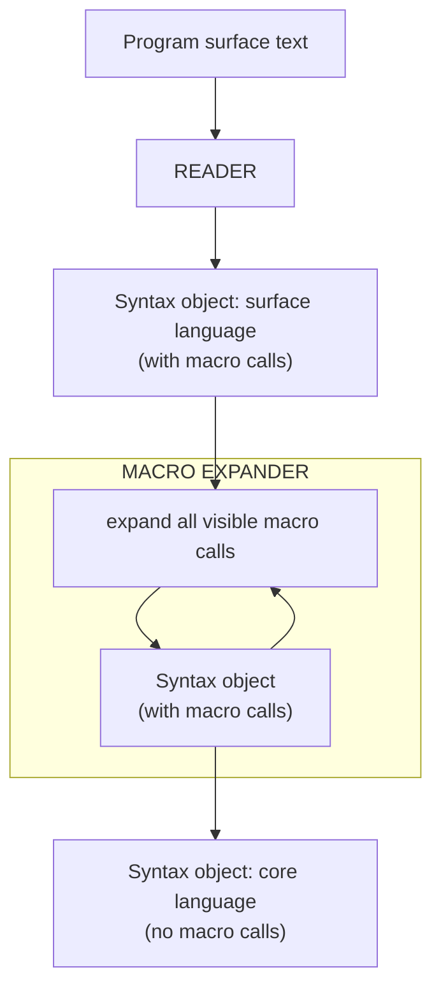
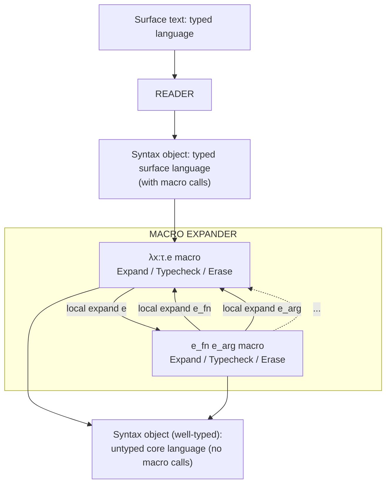

# Type Systems as Macros

Stephen Chang, Alex Knauth, and Ben Greenman

PLT @ Northeastern University, Boston, MA, USA

{stchang,alexknauth,types}@ccs.neu.edu

> Converted from PDF.

## Abstract

We present TURNSTILE, a metalanguage for creating typed embedded languages. To implement the type system, programmers write type checking rules resembling traditional judgment syntax. To implement the semantics, they incorporate elaborations into these rules. TURNSTILE critically depends on the idea of linguistic reuse. It exploits a macro system in a novel way to simultaneously type check and rewrite a surface program into a target language. Reusing a macro system also yields modular implementations whose rules may be mixed and matched to create other languages. Combined with typical compiler and runtime reuse, TURNSTILE produces performant typed embedded languages with little effort.

**Categories and Subject Descriptors D.3.2 [Programming Languages]: Specialized application languages**

**Keywords macros, type systems, typed embedded DSLs**

## 1. Typed Embedded Languages

As Paul Hudak asserted, “we really don’t want to build a programming language from scratch ... better, let’s inherit the infrastructure of some other language” [23]. Unsurprisingly, many modern languages support the creation of such embedded languages [3, 18, 20, 22, 24–26, 41, 43, 46].

Programmers who wish to create typed embedded languages, however, have more limited options. Such languages typically reuse their host’s type system but, as a prominent project [45] recently remarked, this “confines them to that type system.” Also, reusing a type system may not create proper abstractions, e.g., type errors may be reported in host language terms. At the other extreme, a programmer can implement a type system from scratch [42], expending considerable effort and passing up many of the reuse benefits that embedding a language promises in the first place.

We present an alternative approach to implementing typed embedded languages. Rather than reuse a type system, we embed a type system in a host’s macro system. In other words, type checking is computed as part of macro expansion. Such an embedding fits naturally since a typical type checking algorithm traverses a surface program, synthesizes information from it, and then uses this information to rewrite the program, if it satisfies certain conditions, into a target language. This kind of algorithm exactly matches the ideal use case for macros. From this perspective, a type checker resembles a special instance of a macro system and our approach exploits synergies resulting from this insight.

With our macro-based approach, programmers may implement a wide range of type rules, yet they need not create a type system from scratch since they may reuse components of the macro system itself for type checking. Indeed, programmers need only supply their desired type rules in an intuitive mathematical form. Creating type systems with macros also fosters robust linguistic abstractions, e.g., they report type errors with surface language terms. Finally, our approach produces naturally modular type systems that dually serve as libraries of mixable and matchable type rules, enabling further linguistic reuse [27]. When combined with the typical reuse of the runtime that embedded languages enjoy, our approach inherits the performance of its host and thus produces practical typed languages with significantly reduced effort.

We use Racket [12, 15], a production-quality Lisp and Scheme descendant, as our host language since Lisps are already a popular platform for creating embedded languages [17, 20]. Racket’s macro system in particular continues to improve on its predecessors [14] and has even influenced macro system design in modern non-Lisp languages [6, 8, 10, 48]. Thus programmers have created Racket-embedded languages for accomplishing a variety of tasks such as book publishing [7], program synthesis [44], and writing secure shell scripts [32].

The first part of the paper (§2-3) demonstrates a connection between type rules and macros by reusing Racket’s macro infrastructure for type checking in the creation of a typed embedded language. The second part (§4) introduces TURNSTILE, a metalanguage that abstracts the insights and techniques from the first part into convenient linguistic constructs. The third part (§5-7) shows that our approach both accommodates a variety of type systems and scales to realistic combinations of type system features. We demonstrate the former by implementing fifteen core languages ranging from simply-typed to Fω, and the latter with the creation of a full-sized ML-like functional language that also supports basic Haskell-style type classes.

## 2. Creating Embedded Languages in Racket

This section summarizes the creation of embedded languages with Racket. Racket is not a single language but rather an ecosystem with which to create languages [12]. Racket code is organized into modules, e.g. LAM:1

```racket
#lang racket                                    LAM
(define-m (lm x e) (λ (x) e))
(provide lm)
```

1 Code note: For clarity and conciseness, this paper stylizes code and thus its examples may not run exactly as presented. Full, runnable examples are available at: www.ccs.neu.edu/home/stchang/popl2017/

Permission to make digital or hard copies of all or part of this work for personal or classroom use is granted without fee provided that copies are not made or distributed for profit or commercial advantage and that copies bear this notice and the full citation on the first page. Copyrights for components of this work owned by others than ACM must be honored. Abstracting with credit is permitted. To copy otherwise, or republish, to post on servers or to redistribute to lists, requires prior specific permission and/or a fee. Request permissions from Permissions@acm.org. Copyright is held by the owner/author(s). Publication rights licensed to ACM.

POPL’17, January 15–21, 2017, Paris, France ACM. 978-1-4503-4660-3/17/01...$15.00 http://dx.doi.org/10.1145/3009837.3009886
<!-- Page 2 -->

A #lang racket declaration allows LAM to use forms and functions from the main Racket language. LAM defines and exports one macro,2 lm, denoting single-argument functions. A Racket macro consumes and produces syntax object data structures. The lm macro specifies its usage shape with input pattern (lm x e) (in yellow to help readability), which binds pattern variables x and e to subpieces of the input, the parameter and body, respectively. The output syntax (λ (x) e) (gray denotes syntax object construction) references these pattern variables (λ is Racket’s λ).

A module serves multiple roles in the Racket ecosystem. Running LAM as a program produces no result since it consists of only a macro definition. But LAM is also a language:

```racket
#lang lam                                      LAM-PROG
(lm x (lm y x))     ; => <function>
((lm x x) (lm x x)) ; stx error! fn application undefined
```

A module declaring #lang lam may only write lm functions; using any other form results in an error. Finally, a Racket module may be used as a library, as in the following LC module:

```racket
#lang racket                                    LC
(require lam)
(provide (rename-out [lm λ] [app #%app]))
(define-m (app e_fn e_arg) (#%app e_fn e_arg))
```

LC imports lm from LAM and also defines app, which corresponds to single-argument function application. LC exports lm and app with new names, λ and #%app, respectively. The #%app in the output of app is core-Racket’s function application form, though programmers need not write it explicitly. Instead, macro expansion implicitly inserts it before applied functions. This enables modifying the behavior of function application, as we do here by exporting app as #%app. Thus a program in the LC language looks like:

```racket
#lang lc                                        LC-PROG
((λ x (x x)) (λ x (x x))) ; => loop!
```

where λ corresponds to lm in LAM and applying a λ behaves according to app in LC. Running LC-PROG loops forever.

Figure 1 depicts compilation of a Racket program, which includes macro expansion. The Racket compiler first “reads” a program’s surface text into a syntax object, which is a tree of symbols and literals along with context information, e.g., in-scope bindings and source locations. The macro expander then expands macro invocations in this syntax object according to macro definitions from the program’s declared #lang. Macro expansion may reveal additional macro uses or even define new macros, so expansion repeats until no macro uses remain. Compilation terminates with a syntax error if expansion of any macro fails. The output of macro expansion contains only references to Racket's core syntax. This paper shows how to embed type checking within macro expansion.

2 define-m abridges Racket’s define-syntax and syntax-parse[9].

$$
\begin{array}{rcl rcl rcl}
\tau & ::= & \tau \to \tau &
e & ::= & x \mid \lambda x:\tau.\,e \mid e\ e &
\Gamma & ::= & x:\tau,\ldots
\end{array}
$$

$$
\frac{x:\tau \in \Gamma}{\Gamma \vdash x : \tau}\;\text{(T-Var)}
\qquad
\frac{\Gamma, x:\tau_1 \vdash e : \tau_2}
     {\Gamma \vdash \lambda x:\tau_1.\,e : \tau_1 \to \tau_2}\;\text{(T-Abs)}
$$

$$
\frac{\Gamma \vdash e_1 : \tau_1 \to \tau_2 \qquad \Gamma \vdash e_2 : \tau_1}
     {\Gamma \vdash e_1\ e_2 : \tau_2}\;\text{(T-App)}
$$

$$
er(x)=x,\qquad
er(\lambda x:\tau.\,e)=\lambda x.\,er(e),\qquad
er(e\ e')=er(e)\ er(e')
$$

Implementation sketch:

```racket
#lang racket                                      STLC
(define-m (checked-λ ...) <when T-ABS> er(...))
(define-m (checked-app ...) <when T-APP> er(...))
```

**Figure 2. Simply-typed λ-calculus**

```racket
(define-m (checked-app e_fn e_arg) ; v0
    #:with (→ τ_in τ_out) (compute-τ e_fn)
    #:with τ_arg (compute-τ e_arg)
    #:when (τ= τ_arg τ_in)
    #:with e_fn (erase-τ e_fn)
    #:with e_arg (erase-τ e_arg)
    (add-τ (#%app e_fn e_arg) τ_out))
```

**Figure 3. A type checking function application macro**

## 3. A Typed λ-Calculus Embedded Language

LC from section 2 implements the untyped λ-calculus. This section augments LC with types and type checking by transcribing formal type rules directly into its macro definitions, producing the simply-typed λ-calculus and demonstrating that Racket’s macro infrastructure can be reused for type checking. Figure 2 presents the standard simply-typed λ-calculus rules, and a skeleton implementation. The macros in this implementation also erase types in the surface language to accommodate the untyped Racket host.

### 3.1 Typed Function Application

Figure 3 presents checked-app, a macro that elaborates typed function application nodes into core Racket and also type checks the syntax tree (“v0” marks this initial version). Additional #:with and #:when conditions guard the macro’s expansion. A pattern and expression follow a #:with and macro expansion continues only if the result of evaluating the latter produces a syntax object that matches the former. The first #:with uses a compute-τ function to compute the type of function e_fn, which must match pattern (→ τ_in τ_out). The second #:with computes the type of argument e_arg, binding it to pattern variable τ_arg. Unlike the first #:with, the τ_arg pattern does not constrain the shape of e_arg’s type but the following #:when asserts that τ_arg and τ_in satisfy predicate τ=. The types in e_fn and e_arg are then erased (lines 5-6) before they are emitted in the macro’s output (overlines mark type-erased expressions, and core Racket forms). Finally, add-τ (line 7) “adds” τ_out to the macro’s syntax object output. In summary, checked-app rewrites a typed function application to an equivalent untyped one, along with its type.



**Figure 1. The Racket compiler’s frontend**

<!-- Page 3 -->

```racket
(define (add-τ e τ) (add-stx-prop e 'type τ))
(define (get-τ e)     (get-stx-prop e 'type))
(define (compute-τ e) (get-τ (local-expand e)))
(define (erase-τ e)   (local-expand e))
(define (comp+erase-τ e) ; get e's type, erase types
    #:with e (local-expand e) #:with τ (get-τ e)
    [e τ])
(define (τ= τ1 τ2) (stx= τ1 τ2))
```

**Figure 4. Helper functions for type checking**

```racket
(define-m (checked-app e_fn e_arg) ; v1
    #:with [e_fn (→ τ_in τ_out)] (comp+erase-τ e_fn)
    #:with [e_arg τ_arg] (comp+erase-τ e_arg)
    #:when (τ= τ_arg τ_in)
    (add-τ (#%app e_fn e_arg) τ_out))
```

**Figure 5. Revise fig 3 to compute and erase types together**

### 3.2 Communicating Macros

The organization of checked-app in figure 3 resembles a combination of its T-APP and erase specification in figure 2. Figure 4 completes checked-app by defining some helper functions, which together establish a communication protocol between type rule macros. These functions utilize syntax properties, which are arbitrary key-value pairs stored with a syntax object’s metadata. For example, checked-app calls add-τ to attach type information to its output, which in turn calls add-stx-prop (figure 4, line 1) to associate a type τ with key 'type on expression e. If all type rule macros follow this protocol, then to compute an arbitrary expression’s type, we simply invoke that expression’s macro and retrieve the attached type from its output. In other words, expanding an expression also type checks it.

We can call Racket’s macro expander to invoke the desired type checking macro but not in the standard manner. Macro expansion typically rewrites all macro invocations in a program at once (figure 1) and repeats this process until there are no more macro calls. Such breadth-first expansion is incompatible with type checking, however, which proceeds in a depth-first manner— a term is well-typed only if its subterms are well-typed—but the local-expand [16] function controls expansion in the desired way, expanding just one syntax object without considering other parts of the program. Thus compute-τ expands its argument with local-expand (figure 4, line 3) and then retrieves its type.

The checked-app macro uses erase-τ to produce syntax without type annotations. If all type rule macros follow this protocol then expanding an expression also erases its types. Separate calls to compute-τ and erase-τ, however, unnecessarily expands syntax twice. The comp+erase-τ function (lines 5-7) eliminates this redundancy and figure 5's revised checked-app uses this function. In general, we carefully avoid extraneous expansions while type checking so as not to change the algorithmic complexity of macro expansion.

Finally, type checking requires a notion of type equality. We cannot compute mere symbolic equality since types are renamable linguistic constructs:

```racket
(require (rename [→ a])) (τ= (a s t) (→ s t)) ; => true

(define →intrnl (λ (ERR "no runtime types")))
(define-m (→ τ_in τ_out) (→intrnl τ_in τ_out))
(define-m (checked-λ [x : τ_in] e) ; v0
    #:with [x e τ_out] (comp+erase-τ/ctx e [x τ_in])
    (add-τ (λ (x) e) (→ τ_in τ_out)))
(define (comp+erase-τ/ctx e [x τ])
    #:with (λ (x) e)
    (local-expand ; y fresh
        (λ (y)
            (let-macro [x (add-τ y τ)] e)))
    #:with τ_out (get-τ e)
    [x e τ_out])
```

**Figure 6. Type checking λ and →macros**

If we represent types with syntax objects, however, type equality is syntax equality and we can reuse Racket’s knowledge of the program’s binding structure (stx= in figure 4 line 8) to compute type equality in a straightforward manner.

### 3.3 Type Environments and Type Checking λ

Figure 6 implements the → type (lines 1-2) as a macro that matches on an input and output type and expands to an application of an internal function that errors at runtime (there are no base types for now, see §4.3). The checked-λ macro requires a type annotation on its parameter (line 4), separated with :. This macro resembles checked-app, except a new comp+erase-τ/ctx function replaces comp+erase-τ. Since the λ body may reference x, comp+erase-τ/ctx computes the body's type in a type context containing x and its type, given as the second argument.

So far, checked-app and checked-λ correspond to T-APP and T-ABS from figure 2, respectively. To implement T-VAR, i.e., type environments, comp+erase-τ/ctx defines a local macro with let-macro3 (figure 6, line 12) and expands an expression e in the scope of this new macro. The local macro is named x and expands to a fresh y that has the desired type τ attached (observe the nested gray highlights). As a result, while expanding e, a reference to x (with no type information) becomes a reference to y (with type information). To avoid unbound y errors during expansion, a (Racket) λ wraps the let-macro before expansion. Finally, comp+erase-τ/ctx returns a tuple of post-expansion y (as x), the type-erased e, and its type τ_out. Effectively, defining a local macro inserts a binding indirection level during macro expansion, enabling the insertion of the desired type information on variable references. Thus T-VAR is implemented, reusing the compile-time macro environment as the type environment. This completes our simply-typed language.

### 3.4 A Few Practical Matters

We have implemented a basic λ-calculus; however, we wish to implement practical languages. This subsection shows how to extend our language with features found in such languages.

Multiple arguments Figure 7 revises our simply-typed language to support multiple arguments. An ellipsis pattern (. . .) matches zero-or-more of the preceding element. If that preceding element binds pattern variables, ellipses must follow later references to those variables, e.g., the revised →macro (line 1) matches zero-or-more input arguments τ_in and ellipses follow τ_in in its output. The other forms are extended similarly. The checked-λ macro uses a slightly modified comp+erase-τ/ctx (line 13) that accepts multi-element contexts. In checked-app (line 5), the “vector” f notation denotes f mapped over its input list.

3 let-macro abbreviates Racket's let-syntax and syntax-parse.

<!-- Page 4 -->

```racket
(define-m (→ τ_in ... τ_out) (→intrnl τ_in ... τ_out))

(define-m (checked-app e_fn e_arg ...)  ; v2
    #:with [e_fn (→ τ_in ... τ_out)] (comp+erase-τ e_fn)
    #:with ([e_arg τ_arg] ...) (comp+erase-τ (e_arg ...))
    #:fail-unless (→τ= (τ_arg ...) (τ_in ...))
        (fmt "~a: expected ~a arguments, got: ~a"
            (src this-stx) (τ_in ...) (τ_arg ...))
    (add-τ (#%app e_fn e_arg ...) τ_out))

(define-m (checked-λ ([x : τ_in] ...) e)  ; v1
    #:with [xs e τ_out]
        (comp+erase-τ/ctx e ([x τ_in] ...))
    (add-τ (λ xs e) (→ τ_in ... τ_out)))
```

**Figure 7. Multi-arity functions and error checking**

```racket
(define-m #%type (#%typeintrnl))
(define (valid-τ? τ) (τ= (compute-τ τ) #%type))

(define-m (checked→ τ ...)
    #:fail-if (nil? (τ ...)) "→ requires >=1 args"
    #:fail-unless (valid-τ? (τ ...))
        (fmt "invalid types: ~a" (τ ...))
    (add-τ (→intrnl τ ...) #%type))

(define-m (checked-λ ([x : τ_in] ...) e)  ; v2
    #:fail-unless (valid-τ? (τ_in ...))
        (fmt "invalid types: ~a" (τ_in ...))
    #:with [xs e τ_out]
        (comp+erase-τ/ctx e ([x τ_in] ...))
    (add-τ (λ xs e) (→ τ_in ... τ_out)))
```

**Figure 8. Checking type well-formedness**

Error messages Figure 7 also reports more useful error messages. The checked-app in figure 5 reports type errors as syntax errors but a better message should indicate the error’s location and the computed and expected types. The checked-app in figure 7 reports such a message using a #:fail-unless condition (lines 6-8) to produce a message from a printf-style format string (this-stx is the current input syntax, analogous to the OO “this”). All our languages strive to report accurate messages in the manner of figure 7, though the paper may not always show this code.

Type well-formedness Our language so far checks the types of terms but does not check whether programmer-written types are valid, e.g., (λ ([x : (→)]) x) or (λ ([x : Undef]) x) are valid programs according to figure 7. Applying these functions result in type errors but the invalid types should be reported before then. Many type checkers validate types via parsing. This is undesirable for our purposes, however, since it prevents defining types not expressible with a grammar. Instead, we use kinds.

To check kinds, we use the same type checking technique from our term-checking macros. Figure 8 defines a single kind named #%type and all types are tagged with this kind (e.g., line 8). Thus, → and λ may validate their input types with valid-τ? (lines 6-7, 11-12). The use of the macro expander to validate types also differentiates when a type is undefined, rather than malformed. Ultimately, the previous examples now produce type errors:

(λ ([x : (→)]) x); TYERR: →requires >= 1 args
(λ ([x : Undef]) x); TYERR: unbound id Undef



**Figure 9. Macro-based typed language implementations**

## 4. A Metalanguage for Typed Languages

### 4.1 Interleaved Type Checking and Rewriting

Section 3’s STLC implementation reveals a synergy between macro expansion and type checking in that Racket’s macro infrastructure can be reused to also check and erase types during its program traversal. Figure 9 refines figure 1 to incorporate this reuse. This organization further suggests a reformulation of figure 2's rules to combine typechecking and erasure, shown in figure 10. A new Γ ⊢ e ≫ e: τ rule reads "in context Γ, e erases to e and has type τ", where contexts consist of variable "erasures", e.g., TE-ABS inserts a binding indirection level in the context in order to add type information for variables and checks a λ body in this context. These rules straightforwardly correspond to our macro-based type system implementation in section 3, where Γ ⊢ e ≫ e: τ is implemented as "in context Γ, e expands to e, with type τ attached". Since this paper focuses on implementation, we do not formally study these new typing rules, though they do suggest how to further improve our approach to implementing typed embedded languages.

### 4.2 The TURNSTILE Metalanguage

Section 3 demonstrates that a macro system’s infrastructure can be reused to implement typechecking. Deploying such an approach, however, requires writing macro-level code to embed type rules into macro definitions despite the resemblance of this code to its mathematical specification. This section introduces TURNSTILE, a Racket DSL for creating practical embedded languages that abstracts the macro-level ideas and insights from the previous section into linguistic constructs at the level of types and type systems.

<!-- Page 5 -->

$$
\begin{array}{rcl rcl rcl}
\tau & ::= & \cdots &
e & ::= & \cdots &
\bar e & ::= & \bar x \mid \lambda \bar x.\,\bar e \mid \bar e\ \bar e \\
\Gamma & ::= & x \gg \bar x:\tau,\ldots
\end{array}
$$

$$
\frac{x \gg \bar x:\tau \in \Gamma}
     {\Gamma \vdash x \gg \bar x : \tau}\;\text{(TE-Var)}
$$

$$
\frac{\Gamma, x \gg \bar x:\tau_1 \vdash e \gg \bar e : \tau_2 \qquad \bar x \notin e}
     {\Gamma \vdash \lambda x:\tau_1.\,e \gg \lambda \bar x.\,\bar e : \tau_1 \to \tau_2}\;\text{(TE-Abs)}
$$

$$
\frac{\Gamma \vdash e_1 \gg \bar e_1 : \tau_1 \to \tau_2 \qquad
      \Gamma \vdash e_2 \gg \bar e_2 : \tau_1}
     {\Gamma \vdash e_1\ e_2 \gg \bar e_1\ \bar e_2 : \tau_2}\;\text{(TE-App)}
$$

**Figure 10. Interleaved typechecking and erasure rules**

```racket
#lang turnstile                                STLC
(define-type-constructor → #:arity > 0)
(define-typerule (#%app e_fn e_arg ...) ≫
    [⊢ e_fn ≫ e_fn ⇒ (→ τ_in ... τ_out)]
    [⊢ e_arg ≫ e_arg ⇐ τ_in] ...
    ------------------------------------
    [⊢ (#%app e_fn e_arg ...) ⇒ τ_out])
(define-typerule (λ ([x_id : τ_in type] ...) e) ≫
    [[ x ≫ x : τ_in] ... ⊢ e ≫ e ⇒ τ_out]
    ------------------------------------
    [⊢ (λ (x ...) e) ⇒ (→ τ_in ... τ_out)])
```

**Figure 11. The STLC implemented with TURNSTILE**

Specifically, TURNSTILE enables writing rules using the syntax from figure 10 but with bidirectional [39] “synthesize” (⇒) and “check” (⇐) arrows replacing the colon, to further clarify inputs and outputs. Figure 11 reimplements STLC with TURNSTILE. TURNSTILE repackages all the infrastructure from section 3 as convenient abstractions, e.g., define-type-constructor (d-t-c) on line 2 and the subsequent define-typerules (d-t) that implement #%app and λ.

TURNSTILE’s syntax further demonstrates the connection between specification and implementation enabled by our macro-based approach. Though programmers may now write with a declarative syntax, STLC’s implementation has not changed as TURNSTILE’s abstractions are mere syntactic sugar for the macros from section 3. For example, ⇒ abbreviates #:with used with comp+erase-τ and thus figure 11, line 4 exactly corresponds to figure 7, line 4. Similarly, ⇐ abbreviates #:fail-unless, #:with, and τ= so figure 11, line 5 corresponds to figure 7, lines 5-8. Finally, ⇒ below the conclusion line corresponds to add-τ as in figure 7, line 9 (crossing the conclusion line inverts the yellow and gray positions of ⇒). The λ d-t’s premise computes e’s type in a type context containing the variables to the left of ⊢ (figure 11, line 9). In addition, the λ input pattern (line 8) utilizes annotations asserting that x is an identifier and τ_in is a valid type.

In general, a d-t resembles a figure 10 rule except the conclusion is split into its inputs and outputs--the (yellow) pattern(s) (and ≫) that begin a definition, and the (gray) syntax following the conclusion line, respectively--such that the definition (and variable scoping) reads top-to-bottom. Figures 10 and 11 additionally differ because d-ts do not explicitly thread through a "Γ", a consequence of reusing Racket's scoping for the type environment. Thus Turnstile programmers only write new type environment bindings in d-ts, analogous to let; existing bindings are implicitly available according to standard lexical scope behavior.

```racket
#lang turnstile                                STLC+PRIM
(extends stlc)
(define-base-type Int)
(define-primop + : (→ Int Int Int))
(define-typerule (#%datum n) ≫
    #:fail-unless (int? n) "Unsupported datum"
    ------------------------------------
    [⊢ (#%datum n) ⇒ Int])
```

**Figure 12. A language extending STLC with integers**

Viewed as type rules, figure 11 appears to be missing the ⇐ rules. While a programmer may write explicit ⇐ rules (see §6), in their absence, TURNSTILE uses this default:

```racket
(define-typerule e ⇐ τ ≫
    [⊢ e ≫ e ⇒ τ_e]
    [τ_e = τ]
    -------------------------
    [⊢ e])
```

This implicit definition corresponds to figure 7, lines 5-8. The first and last lines again comprise the input and output components of the rule’s “conclusion”, respectively, with the “expected” type now a part of the input pattern matching.

Though TURNSTILE programmers may implement type rules in a declarative style, such a style may be insufficient for creating practical languages, e.g., they do not allow specification of detailed error messages. Therefore, all the macro features from section 3 are also available to a d-t definition, giving TURNSTILE type rules access to the full power of Racket’s macro system. For example, a programmer may add #:fail-unless error messages as in figure 7. Here is a refined #%app that further differentiates arity errors:

```racket
(define-typerule (#%app e_fn e_arg ...) ≫
    [⊢ e_fn ≫ e_fn ⇒ (→ τ_in ... τ_out)]
    #:fail-unless (len= (e_arg ...) (τ_in ...))
        (fmt "~a: Fn has arity ~a, got ~a args"
            (src this-stx)
            (len (τ_in ...)) (len (e_arg ...)))
    [⊢ e_arg ≫ e_arg ⇐ τ_in] ...
    ------------------------------------
    [⊢ (#%app e_fn e_arg ...) ⇒ τ_out])
```
### 4.3 Reusing a Type System

TURNSTILE type rules from one language may be reused in the implementation of another. Though the STLC language implements function application and λ, it defines no base types and thus no well-typed programs. We next add integers and addition but instead of revising STLC, we reuse its rules in a new language, analogous to section 2. Specifically, STLC+PRIM in figure 12 uses STLC as a library, importing and re-exporting its type rules with extends. To STLC’s definitions, STLC+PRIM adds an Int base type (line 4), a + primop (line 5), and integer literals (lines 7-10). Just as the macro expander inserts #%app before applied functions, it also wraps literals with #%datum, whose behavior is overridden in figure 12 to add types to integers. With STLC+PRIM, we can now write well-typed programs.
<!-- Page 6 -->

```racket
#lang turnstile                                EXIST
(extends stlc+reco+var)
(define-type-constructor ∃ #:bvs = 1)
(def-typerule (pack [τ_hide type e] as (∃ (X) τ_body)) ≫
    [⊢ e ≫ e ⇐ (subst τ_hide X τ_body)]
    ------------------------------------
    [⊢ e ⇒ (∃ (X) τ_body)])
(def-typerule (open [x_id e_packed] with X_id in e) ≫
    [⊢ e_packed ≫ e_packed ⇒ (∃ (Y) τ_bod)]
    [( X )([ x ≫ x : (subst X Y τ_bod)]) ⊢ e ≫ e ⇒ τ]
    ------------------------------------
    [⊢ (let ([x e_packed]) e) ⇒ τ])
```

**Figure 13. A language with existential types**

## 5. A Series of Core Languages

To confirm that our approach to typed languages handles a variety of type systems, we implemented a series of textbook core languages [38]. This section describes a few examples.

### 5.1 Types That Bind: Existential Types

Figure 13 depicts EXIST, a language with existential types; it reuses records and variants from another language. The #:bvs option (line 2) specifies that an ∃ type binds one variable and thus has surface syntax (∃ (X) τ_body).

Figure 4 (line 8) introduced type equality as structural equality of syntax objects. Type equality of quantified types, however, must additionally consider alpha equivalence. While other systems commonly convert to alternate representations such as de Bruijn indices [5] to implement this behavior, our use of syntax objects for types remains sufficient since these objects already contain knowledge of the program’s binding structure. Thus the τ= used by TURNSTILE looks like:

```racket
(define [(τ= (C1 Xs τ3) (C2 Ys τ4))
         (and (τ= C1 C2) (τ= (subst Ys Xs τ3) τ4))]
        [else <...>])  ; structural traversal
```

This updated τ= function specifies multiple input patterns. The first clause matches binding types where equality of such types with the same constructor is equivalent to renaming parameter references to the same name and recursively comparing the resulting body for equality. Otherwise, types are structurally compared. A subst function performs this renaming:

```racket
(define (subst v x e)
    (if (and (id? e) (binds? x e)) v  ; else traverse e <...>))
```

Specifically, (subst v x e) replaces occurrences of x in e with v, where binds? determines “occurrence” by examining lexical information in the syntax objects. Thus substitution is a structural traversal and no renaming is necessary.

The pack and open macros use τ= and subst: pack assigns a term e an existential type (∃ (X) τ_body), where e has concrete type equal to replacing X in τ_body with τ_hide; dually, open binds x to an existentially-typed e_packed's value, type variable X to e_packed's hidden type, and then checks an expression e in the context of X and x. To the left of ⊢ (figure 13, line 9) is two environments: a list of type variables and the standard environment for term variables. The (∃ (Y) τ_bod) type of e_packed is “opened”, so x has type τ_bod but with occurrences of the existentially-bound Y (not in scope in e) replaced with its “opened” X name. Here is a typical counter example (×, rcrd, and prj correspond to records):

```racket
#lang turnstile                                STLC+SUB
(extends stlc+prim #:except #%datum +)
(define-base-types Top Num Nat)
(define-typerule #%datum <...>)
(define-primop + : (→ Num Num Num))
(define-primop add1 : (→ Int Int))
(define (τ<: τ1 τ2)
    (or (τ= τ1 τ2)
        (syntax-parse (τ1 τ2)
            [(_ Top) true]
            [(_ Num) (τ<: τ1 Int)]
            [(_ Int) (τ<: τ1 Nat)]
            [((→ τi1 ... τo1) (→ τi2 ... τo2))
             (and (→τ<: (τi2 ...) (τi1 ...)) (τ<: τo1 τo2))]
            [else false])))
(set-τ⊑ τ<:) ; no need to redefine #%app or other rules
```

**Figure 14. A simply-typed language with subtyping**

```racket
#lang exist
(define COUNTER
    (pack [Nat (rcrd [new = 1] [inc = add1]
                     [get = (λ ([x : Nat]) x)])]
          as (∃ C (× [new : C] [inc : (→ C C)] [get : (→ C Nat)]))))
(open [c COUNTER] with Count in
    (+ ((prj c get) ((prj c inc) (prj c new)))  ; => 2
       (add1 (prj c new))))                       ; TYERR: expected type Nat, got Count
```

### 5.2 Subtyping and Enhanced Modularity

Figure 14 presents STLC+SUB, a language with subtyping that reuses parts of STLC+PRIM from figure 12 but adds new base types and redefines #%datum and + with these types. One might not expect STLC+SUB to be able to reuse type rules that do not consider subtyping. However, TURNSTILE exposes hooks for common type operations and implements type checking in terms of these hooks, enabling better reuse. For example, τ= in figure 5, line 4 is actually an overridable “type check relation” (initially set to τ=). These language-level hooks are implemented with Racket parameters [19], which allow a controlled form of dynamic binding. Thus STLC+SUB defines a new τ<: predicate and installs it as the τ⊑ type check relation (we oval-box parameter names), enabling reuse of #%app and λ from STLC.

TURNSTILE pre-defines parameters like τ⊑ and τ_eval; the latter is called before attaching types to syntax. Each language may also define new parameters, e.g., STLC+SUB additionally defines join and uses it in conditionals.

### 5.3 Defining Types and Kinds

Our implementations macro-expand a term to type check and erase its types. We can check kinds the same way: expanding a type kind checks and erases kinds. The kind erasing may cause problems, however, since a type judgement may use both types and kinds. Nevertheless, TURNSTILE can define a kind system like in Fω. To address the problem, figure 15 reformulates some Fω rules with our ≫ relation. Specifically, T-TABS and K-ALL erase a ∀’s kind annotation, but “save” it with ⋆, now a kind constructor, in the same manner that →“saves” a λ’s type annotations. T-TAPP then checks that its argument type has a kind matching the saved annotation.

Figure 16 implements FOMEGA utilizing figure 15’s insights: it introduces a new kind category of syntax, defines ⇒ and ⋆ kinds, and directs the ∀ type to construct its kind with a ⋆ "arrow". Lines 8-9 connect "kinds" and "types" where line 8 enables reuse of previously-defined types, and line 9 redefines "well-formed" types. Finally, the Λ rule type checks its body in its type variable's context, and the inst rule instantiates an expression e at type τ by computing e's ∀ type and that type's kind (⋆κ), and checking that τ has kind κ.

<!-- Page 7 -->

$$
\begin{array}{rcl rcl}
e & ::= & x \mid \lambda x:\tau.\,e \mid e\ e \mid \Lambda X::\kappa.\,e \mid e\ \tau
  & & \text{(terms with types)} \\
\tau & ::= & X \mid \tau \to \tau \mid \forall X::\kappa.\,\tau \mid \lambda X::\kappa.\,\tau \mid \tau\ \tau
  & & \text{(types with kinds)} \\
\bar e & ::= & \bar x \mid \lambda \bar x.\,\bar e \mid \bar e\ \bar e
  & & \text{(typeless terms)} \\
\kappa & ::= & \star\kappa\ldots \mid \kappa \Rightarrow \kappa
  & & \text{(kinds)} \\
\bar\tau & ::= & \bar X \mid \bar\tau \to \bar\tau \mid \forall X.\,\bar\tau \mid \lambda X.\,\bar\tau \mid \bar\tau\ \bar\tau
  & & \text{(kindless types)} \\
\Gamma & ::= & b,\ldots
  & b ::= & X \gg \bar X :: \kappa \mid x \gg \bar x : \tau :: \kappa
\end{array}
$$

$$
\frac{\Gamma, X \gg \bar X::\kappa \vdash e \gg \bar e : \bar\tau :: \kappa}
     {\Gamma \vdash \Lambda X::\kappa.\,e \gg \bar e : \forall X.\,\bar\tau :: \star\kappa}\;\text{(T-TAbs)}
$$

$$
\frac{\Gamma \vdash e \gg \bar e : \forall X.\,\bar\tau_2 :: \star\kappa \qquad
      \Gamma \vdash \tau \gg \bar\tau :: \kappa \qquad
      \Gamma \vdash \bar\tau_2 :: \kappa_2}
     {\Gamma \vdash e\ \tau \gg \bar e : \bar\tau_2[X \leftarrow \bar\tau] :: \kappa_2}\;\text{(T-TApp)}
$$

$$
\frac{X \gg \bar X :: \kappa \in \Gamma}
     {\Gamma \vdash X \gg \bar X :: \kappa}\;\text{(K-Var)}
$$

$$
\frac{\Gamma, X \gg \bar X::\kappa \vdash \tau \gg \bar\tau :: \star}
     {\Gamma \vdash \forall X::\kappa.\,\tau \gg \forall X.\,\bar\tau :: \star\kappa}\;\text{(K-All)}
$$

**Figure 15. Some Fω rules using figure 10’s ≫ relation**

```racket
#lang turnstile                                FOMEGA
(extends stlc+prim)
(define-stx-category kind)
(define-kind-constructor ⇒ #:arity >= 1)
(define-kind-constructor ⋆ #:arity >= 0)
(define-type-constructor ∀ #:bvs = 1 #:arrow ⋆)
; link types and kinds
(set- kind? (λ (k) (or (#%type? k) (kind? k))))
(set- type? (λ (t) (and (kind? t) (not (⇒? t)))))
; ...
(define-typerule (Λ [X_id :: κ kind] e) ≫
    [([ X ≫ X :: κ]) () ⊢ e ≫ e ⇒ τ_e]
    ------------------------------------
    [⊢ e ⇒ (∀ ([X : κ]) τ_e)])
(define-typerule (inst e τ) ≫
    [⊢ e ≫ e ⇒ (∀ X τ_body) (⇒ (⋆ κ))]
    [⊢ τ ≫ τ ⇐ κ]
    ------------------------------------
    [⊢ e ⇒ (subst τ X τ_body)])
```

**Figure 16. A language with higher-order polymorphism**


### 5.4 Reusing Languages

Table 1 summarizes extensions and reuse in fourteen core language implementations. A row and color represents a language and features are in columns. A diamond marks a feature’s first implementation and down-column appearances of the feature’s color indicates reuse. Thus single-color columns and multi-color rows indicate abundant reuse. For example, all languages share the same λ; also, languages with basic types share a τ= while those with binding types use an extended version. A ⊕ marks feature extension; a dotted line connects non-adjacent-row extensions.

Table 2 summarizes implementation sizes from table 1. Each column represents a different implementation of the same language: the first uses TURNSTILE; the second uses TURNSTILE but does not import other implementations; and the third uses plain Racket. Though the last two columns are estimates (2 significant figures)—we did not implement every permutation of every language—they still indicate the degree of reuse.

**Figure 17. A basic side effect analysis.**

```racket
#lang turnstile                                EFFECT
(extends stlc+prim #:except #%app λ)
(define-base-type Void)
(define-type-constructor Ref #:arity = 1)
(define-typerule (ref e) ≫
    [⊢ e ≫ e (⇒ : τ) (⇒ :ν π)]
    ------------------------------------
    [⊢ (box e) (⇒ : (Ref τ)) (⇒ :ν (∪ (src (ref e)) π))])
(define-typerule (deref e) ≫
    [⊢ e ≫ e (⇒ : (Ref τ)) (⇒ :ν π)]
    ------------------------------------
    [⊢ (unbox e) (⇒ : τ) (⇒ :ν π)])
(define-typerule (:= e_ref e) ≫
    [⊢ e_ref ≫ e_ref (⇒ : (Ref τ_ref)) (⇒ :ν π_ref)]
    [⊢ e ≫ e (⇐ : τ_ref) (⇒ :ν π)]
    ------------------------------------
    [⊢ (set-box! e_ref e) (⇒ : Void) (⇒ :ν (∪ π_ref π))])
(define-typerule (#%app e_fn e_arg) ≫
    [⊢ e_fn ≫ e_fn (⇒ : (→ τ_in τ_out) (⇒ :ν π_app)) (⇒ :ν π_fn)]
    [⊢ e_arg ≫ e_arg (⇐ : τ_arg) (⇒ :ν π_arg)]
    ------------------------------------
    [⊢ (#%app e_fn e_arg) (⇒ : τ_out) (⇒ :ν (∪ π_fn π_arg π_app))])
(define-typerule (λ [x_id : τ_in type] e) ≫
    [[ x ≫ x : τ_in] ⊢ e ≫ e (⇒ : τ_out) (⇒ :ν π)]
    ------------------------------------
    [⊢ (λ (x) e) (⇒ : (→ τ_in τ_out) (⇒ :ν π))])
```

### 5.5 More Than Types: A Type-and-Effect System

Table 1’s languages mostly use a typical Γ ⊢ e: τ relation though TURNSTILE is not limited to this relation. Rather, programmers may specify propagation of any number of arbitrary properties. For example, figure 17 presents EFFECT, a language with a basic type and effect system [33]. The language adds Void and Ref types,
<!-- Page 8 -->

| Language Name | w/ TURNSTILE | no reuse* | w/ Racket* |
|---|---|---|---|
| stlc | 32 | 32 | |
| stlc+prim | 23 | 55 | |
| extended stlc | 143 | 200 | |
| tuples | 32 | 230 | |
| records+variants | 171 | 400 | |
| lists | 73 | 470 | 1100 |
| reference cells | 29 | 500 | |
| subtyping | 107 | 160 | 1300 |
| sub+records | 50 | 610 | |
| (iso) recursive | 27 | 260 | |
| existential | 69 | 470 | |
| system F | 28 | 83 | |
| F<: | 89 | 700 | |
| Fω | 112 | 190 | |

* = estimate

**Table 2. Line count comparisons of table 1’s languages**

and ref, deref, and := type rules for allocation of, dereference of, and assignment to reference cells, respectively (box is Racket’s ref cells). In addition to types, the language tracks source locations (π) of ref allocations (line 9). The ref rule exhibits new syntax: instead of a type to the right of ⇒, a programmer may write multiple ⇒ arrows matching multiple properties. Thus ref specifies that expansion of e (line 6) computes both a type (keyed on :) and a set of locations π (keyed on :ν). The key symbols match the user-specified symbols below the conclusion line. The := rule uses both ⇐ (for the type) and ⇒ (for the locations) simultaneously (line 16).

EFFECT contrasts with table 1’s languages in that it cannot reuse #%app and λ due to its incompatible type relation. (It does reuse some types and type operations.) The new #%app and λ rules show that both terms and types carry the:ν property. Specifically, λ propagates:ν to function types (line 30), expressed with a nested ⇒ (like the double-⇒ syntax for kinds from figure 16), because evaluating a λ does not trigger allocations in its body. Applying a function does evaluate the body, so #%app transfers locations from the function type (line 21) to the application term (line 26).

## 6. A Full-Sized Language

To show that TURNSTILE scales to real-world type systems, we created MLISH, an ML-like language with local type inference, recursive user-defined algebraic data types, pattern matching, and basic Haskell-style type classes [47], along with “batteries” such as efficient data structures, mutable state, generic sequence comprehensions, I/O, and concurrency primitives. MLISH also demonstrates how TURNSTILE easily incorporates type-system-directed program transformations. This section explains a few features.

Local type inference MLISH aims to follow Pierce and Turner’s empirical inference guidelines [39]. Specifically, programmers need not write most annotations and instantiations except top-level function signatures, which are useful as documentation, and some λ annotations, which are rare.

Figure 18 sketches basic type inference in λ and #%app. Multiple clauses comprise λ, whose input patterns are checked in order. The first clause matches unannotated λs whose context determines its type, indicated with ⇐ (line 4). The second matches annotated λs with implicitly bound type variables, computes these variables, and then recursively invokes the λ rule (indicated with ≻) with explicit type variables. In this manner, a surface language with implicit type variables rewrites to one with explicit binders, reusing the macro system for the type-system-directed rewrite. Finally, the third clause matches λs with explicit type variable binders; it resembles λ from figure 11. An MLISH define for top-level functions uses λ, splitting a definition into a runtime component and a macro that adds type information:

```racket
#lang turnstile                                MLISH
(define-typerule λ
    ; no annotations, use expected type
    [(λ (x_id ...) e) ⇐ (∀ (X ...) (→ τ_in ... τ_out)) ≫
        [( X ...) ([ x ≫ x : τ_in] ...) ⊢ e ≫ e ⇐ τ_out]
        ------------------------------------
        [⊢ (λ (x ...) e)]]
    ; variable annotations, with free tyvars
    [(λ ([x_id : τ_in] ...) e) ≫
        #:with (X ...) (free-tyvars (τ_in ...))
        ------------------------------------
        [≻ (λ {X ...} ([x : τ_in] ...) e)]]
    ; variable annotations, explicit tyvar binders
    [(λ {X ...} ([x_id : τ_in] ...) e) ≫
        [( X ...) ([ x ≫ x : τ_in] ...) ⊢ e ≫ e ⇒ τ_out]
        ------------------------------------
        [⊢ (λ (x ...) e) ⇒ (∀ (X ...) (→ τ_in ... τ_out))]])
(define-typerule #%app
    ; infer polymorphic instantiation, with expected type
    [(#%app e_fn e_arg ...) ≫
        #:with τ_expct (get-expected-τ this-stx)
        [⊢ e_fn ≫ e_fn ⇒ (∀ Xs (→ τX ...))]
        [⊢ e_arg ≫ e_arg ⇒ τ_arg] ...
        #:with (τ ...) (solve Xs (τ_arg ... τ_expct) (τX ...))
        ------------------------------------
        [≻ (#%app {τ ...} e_fn e_arg ...)]]
    ; infer polymorphic instantiation, no expected type
    [(#%app e_fn e_arg ...) ≫
        [⊢ e_fn ≫ e_fn ⇒ (∀ Xs (→ τ_inX ... τ_outX))]
        [⊢ e_arg ≫ e_arg ⇒ τ_arg] ...
        #:with (τ ...) (solve Xs (τ_arg ...) (τ_inX ...))
        ------------------------------------
        [≻ (#%app {τ ...} e_fn e_arg ...)]]
    ; explicit instantiation of polymorphic function
    [(#%app {τ type ...} e_fn e_arg ...) ≫
        [⊢ e_fn ≫ e_fn ⇒ (∀ Xs (→ τX ...))]
        #:with (τ_in ... τ_out) (subst (τ ...) Xs (τX ...))
        [⊢ e_arg ≫ e_arg ⇐ τ_in] ...
        ------------------------------------
        [⊢ (#%app e_fn e_arg ...) ⇒ τ_out]])
```

**Figure 18. Type inference in MLISH #%app and λ**

```racket
(define-typerule (define (f [x : τ] ... → τ_out) e) ≫
    #:with Xs (free-tyvars (τ ...))
    [⊢ (λ (x ...) e) ≫ e_λ ⇐ (∀ Xs (→ τ ... τ_out))]
    ------------------------------------
    [≻ (define f_intrnl e_λ)
        (define-m f (add-τ f_intrnl τ_f))])

(define-m (define-type (Ty X ...)
    (Constr [fld : τX] ...) ...)
    (define-type-constructor Ty
        #:arity = (len (X ...))
        #:extra ((Constr [fld τX] ...) ...))
    (struct Constr_intrnl (fld ...)) ...
    (define-typerule (Constr e_arg ...) ≫
        #:with C (add-τ Constr_intrnl
            (∀ (X ...) (→ τX ... (Ty X ...))))
        ------------------------------------
        [≻ (#%app C e_arg ...)]) ...)

(def-typerule (match e_m with [C x ... -> e] ...+) ≫
    [⊢ e_m ≫ e_m ⇒ τ_m]
    #:with [(C_expect [fld τ_fld] ...) ...] (get-extra τ_m)
    #:fail-unless (set= (C ...) (C_expect ...))
        (fmt "missing ~a" (set-diff (C ...) (C_expect ...)))
    [[ x ≫ x : τ_fld] ... ⊢ e ≫ e ⇒ τ] ...
    #:when (same-τ? (τ ...))
    ------------------------------------
    [⊢ (let ([v e])
         (cond [(C_expect? v)
                 (let ([x (get-fld v)] ...) e)] ...))
        ⇒ (first (τ ...))])
```

**Figure 19. Defining types and pattern matching in MLISH**

<!-- Page 9 -->

Original visual matrix: [figures/table-1.png](figures/table-1.png). The table below transcribes the same reuse idea textually: `⟡` marks features implemented in that row, `⊕` marks extensions of earlier features, and source language names replace the original cell colors. `⇢` marks a dotted-line jump from a non-adjacent earlier row; rows skipped by that jump do not participate in that inheritance.

| Language | `⟡` Implemented Here | `⊕` Extended Here | Reuses / Combines |
|---|---|---|---|
| `stlc` | λ, application, `→`, `τ=` | | |
| `stlc+prim` | `Int`, `+`, `datum` | | `stlc`: λ, application, `→`, `τ=` |
| `extended stlc` | `Bool`, `if`, `letrec`, `begin`, `define`, `alias` | | `stlc`, `stlc+prim` |
| `tuples` | tuple type, tuple values | | `stlc`, `stlc+prim` |
| `records+variants` | records, variants | tuple infrastructure | `stlc`, `stlc+prim`, `tuples` |
| `lists` | `List` | | `records+variants` runtime/type infrastructure |
| `reference cells` | `Ref` | | `stlc`, `stlc+prim` |
| `subtyping` | `Top`, `Nat`, `Num`, `τ<:`, `join` | `datum` ⇢ from `stlc+prim`; primitive operations/type checks | `stlc`, `stlc+prim`; skipped rows on the `datum` jump are non-participants |
| `sub+records` | | record/variant typing ⇢ from `records+variants`, combined with subtyping | `records+variants`, `subtyping`; skipped rows on the record/variant jump are non-participants |
| `(iso) recursive` | iso-recursive type `μ` | type equality/evaluation support ⇢ from earlier type-operation hooks | `stlc`; skipped rows on the type-operation jump are non-participants |
| `existential` | existential type `∃` | | `records+variants` |
| `system F` | universal type `∀`, instantiation | | `stlc`, type binding/equality support |
| `F<:` | bounded polymorphism | subtyping ⇢ from `subtyping`; `∀`/instantiation from `system F` | `subtyping`, `system F`; skipped rows on dotted jumps are non-participants |
| `Fω` | type-level λ, type application, kind invocation, kinds | `∀`/instantiation from `system F`; kind/type checking | `system F`, kind/type-operation hooks |

**Table 1. Implemented Languages**
<!-- Page 10 -->

To implement a ⇐ type rule, e.g., figure 18 lines 4-7, MLISH propagates “expected type” information from an expression’s context by attaching a syntax property before expansion, making the information available while type checking that expression. A ⇐ type rule’s input matches on this expected type (line 4), and also implicitly attaches it to the output syntax (line 7). A non-⇐ type rule may also inspect the expected type, as with #%app. Specifically, the first #%app clause extracts the expected type (line 22) and uses it to solve for the type variables (line 26). The clause then recursively invokes #%app with explicit instantiation types. In this manner, a surface language with inferred instantiation rewrites to one with explicit instantiation. The second #%app clause resembles the first except it does not use the expected type. The third instantiates the polymorphic function type (line 39) and then checks the function arguments as in figure 11.

Algebraic datatypes Figure 19’s define-type macro defines sum-of-product datatypes in MLISH; it expands to a series of definitions (gray box): a type constructor (lines 3-5), where the #:extra argument communicates information about the type to other type rules, e.g., to check match clause completeness; Racket structs (line 6) implementing runtime constructors; and type rules (lines 7-11) that leverage #%app to instantiate polymorphic constructors.

Pattern matching In figure 19’s match, one or more clauses follow e_m, matching its possible variants. The rule uses “extra” information from the type to check clause exhaustiveness (lines 14-16). Otherwise match expands to a conditional that extracts components of e_m with accessors (also from the “extra” information).

Here is an MLISH example:

```racket
(define-m (define-tc (Cls X ...) op_generic : τ_op)
    (define-m (Cls X ...) [op_generic : τ_op])
    (define-typerule (op_generic e ...) ⇐ τ_o ≫
        [⊢ e ≫ e ⇒ τ] ...
        #:with op_concrete (lookup op_generic (→ τ ... τ_o))
        ------------------------------------
        [≻ (#%app op_concrete e ...)]))

(define-m (define-instance (Cls τ ...) op_gen op_c)
    #:with [op : τ_concrete] (local-expand (Cls τ ...))
    #:when (equal? op_gen op)
    [⊢ op_c ≫ op_concrete ⇐ τ_concrete]
    #:with op_mang (mangle op τ_concrete)
    ------------------------------------
    [≻ (define-m op_mang (add-τ op_concrete τ_concrete))])

(define-typerule #%app
    ; ...
    [(#%app {τ type ...} e_fn e_arg ...) ≫
        [⊢ e_fn ≫ e_fn ⇒ (∀ Xs (=> TC (→ τX ...)))]
        #:with (τ_in ... τ_out) (subst (τ ...) Xs (τX ...))
        [⊢ e_arg ≫ e_arg ⇐ τ_in] ...
        #:with [op_generic : τ_generic] TC
        #:with τ_concrete (subst (τ ...) Xs τ_generic)
        #:with op_concrete (lookup op_generic τ_concrete)
        ------------------------------------
        [⊢ (#%app e_fn op_concrete e_arg ...) ⇒ τ_out]])
```

**Figure 20. Type classes in MLISH**

```racket
#lang mlish
(define-type (Tree X)
    (leaf [val : X])
    (node [l : (Tree X)] [r : (Tree X)]))
(define (sum-tr [t : (Tree Int)] → Int)
    (match t with
        [node l r -> (+ (sum-tr l) (sum-tr r))]))
; TYERR: match: not enough clauses, missing leaf
```

Type classes Figure 20 sketches an implementation of type classes. The rules interleave typechecking and program rewriting, demonstrating how TURNSTILE naturally accommodates such interleaving. MLISH type classes only support basic features such as subclassing (unsupported features include multi-parameter type classes and overlapping instances). For simplicity, this paper shows single-operation type classes, though MLISH supports the general multi-operation version. The define-tc form shows that two definitions implement a type class: a macro for the type class itself (line 2) that expands to its generic operation and type, and a type rule for that operation (lines 3-7) that looks up a concrete operation (line 5) based on the generic name and the concrete types of its usage. MLISH type classes reuse the compile-time macro environment for lookups, where a concrete operation’s name, installed by define-instance (lines 8-14), is a mangling of the generic name and specific concrete types.

Consequently, functions utilizing generic operations (this λ implementation is not shown) have a typeclass component in their type (the => constructor on line 18) and these functions implicitly have an extra concrete operation argument. The #%app rule implicitly inserts this argument by: extracting the generic operation of the type class (line 21); looking up the concrete operation based on instantiation types for the function (lines 22-23); and adding this operation to the application (line 25).
<!-- Page 11 -->

| test description | core langs (§5) | MLISH (§6) |
|---|---|---|
| coverage | 4313 | 2467 |
| RW OCaml [31] | | 610 |
| Benchmarks Game [1] | | 852 |
| Okasaki [34] | | 2014 |
| Other examples (e.g., nqueens) | | 559 |
| total (LoC, incl. comments) | 4313 | 6502 |

**Table 3. Testing TURNSTILE-created languages**

## 7. Creating a Test Suite

Sections 5 and 6 show that our approach accommodates a variety of typed languages. This section explains how we validate these languages with a test suite of real-world programs [1, 31, 34]. Our tests utilize TURNSTILE’s unit-testing framework, which accommodates testing of typechecking successes, failures, as well as error messages. The testing framework also allows all tests to be written with a language’s surface syntax, rather than an internal AST structure. The following example defines a function f, tests the type of f, and both a successful and failing application of f:

```racket
#lang mlish    (require typechecker-tester)
(define (f [x : Int] → Int) x)
(check-type f : (→ Int Int))
(check-type (f 1) : Int => 1)
(typecheck-fail (f 1 2) #:msg "Wrong number of args")
```

Table 3 summarizes our test suite, which includes both coverage tests checking general functionality and corner cases, and real-world examples. For the latter, Real World OCaml [31] supplied functional tests while the Benchmarks Game [1] consisted of more imperative tests. Okasaki's data structures tested the limits of our type system. For example, in discussing polymorphic recursion (chapter 10), Okasaki writes:
"We will often present code as if SML supports [polymor. recursion]. This code will not be executable but will be easier to read."

We were able to add polymorphic recursion to MLISH, by leveraging recursive definition forms in the host, and implemented the data structures in question, demonstrating both the ability to implement tricky type system features with TURNSTILE, and the ease with which one can do so.


## 8. Related Work

Many researchers have developed extensible type systems [2, 4, 11, 28, 30, 36, 37]. These frameworks typically augment a fixed host type system, which imposes some limitations on what kinds of extensions are allowed. For example, some do not allow defining new types, while others may only define new rules expressible with the host system. Though ease of extension is a feature of TURNSTILE-created languages (any language in the Racket ecosystem may serve as TURNSTILE’s host language, so TURNSTILE may also be used to extend a typed language [21] like the other systems), it is not the sole focus of our work. Instead, we wish to support the creation of complete languages that may utilize arbitrary type rules.

Others have devised special-purpose macro systems for building type checkers [13, 35]. Whether these systems accommodate embedded DSL creation, however, remains undetermined. Our work takes the opposite approach. We start with a popular platform for creating embedded languages and show that its general macro system already accommodates type checking.

Typed Racket [42] pioneered the idea of creating a typed language using syntax extensions. While languages created with TURNSTILE share this high-level description, our approach differs in its goals and implementation details. Typed Racket aims to type check Racket programs and thus first expands a program, and then feeds this expanded program to a conventional monolithic type checker that recognizes only core Racket forms (for this reason Typed Racket is considered a “sister” language [43] to Racket rather than an embedded language). In contrast, we wish to support the creation of arbitrary typed surface languages, and we do so via implementations that interleave macro expansion and type checking. This requires programmers to implement type rules for all surface constructs rather than just core forms, however, but TURNSTILE helps this process by providing a concise declarative syntax for writing these rules. Interleaving macro expansion and type checking yields the additional benefit of using type information during expansion, allowing types to direct a macro’s output. Finally, since our language implementations are just a series of macros, they are naturally modular and thus easily extended and reused.

The TinkerType [29] system also separates type rules and operations into reusable components. The framework combines raw strings rather than linguistic components, however, and is designed for modeling and typesetting calculi rather than creating practical languages. Nonetheless, our approach may benefit from some of TinkerType’s consistency checks when combining components.

## 9. Conclusions and Future Work

We present a novel use of macros to create practical typed embedded languages. Our approach is not constrained to a particular type system, yet programmers do not have to implement a system from scratch because they can reuse the infrastructure of a macro system. To this end we introduce TURNSTILE, a metalanguage for creating typed languages using a declarative type-and-rewriting rule syntax. We conjecture that language implementers will benefit from our approach, as non-experts may reduce the burden of language creation, while researchers may rapidly iterate and experiment with new type features and combinations of features.

We next plan to further validate our idea by implementing more languages, and to extend our approach to more complex analyses. In addition, we plan to explore whether our approach to implementing typed embedded languages is compatible with other, non-Lisp-style syntax extension systems. Finally, we plan to investigate whether the connections between type checking and macro processing that we have described might inform the future design of both kinds of systems. The fact that many type systems already intertwine type checking and program rewrites [39, 40, 47] suggests that perhaps languages should come equipped with a general framework for defining macros and type rules, as well as some combination of the two.

## Acknowledgments

This paper is supported by NSF grant SHF 1518844. We thank Asumu Takikawa, Matthias Felleisen, and our reviewers for feedback on drafts, Ryan Culpepper for technical discussions about macros, and Alexis King for suggestions on language design.

## References

[1] The computer language benchmarks game. URL http://benchmarksgame.alioth.debian.org/.
[2] C. Andreae, J. Noble, S. Markstrum, and T. Millstein. A framework for implementing pluggable type systems. In Proceedings of the 21st Annual ACM SIGPLAN Conference on Object-oriented Programming Systems, Languages, and Applications, pages 57–74, 2006.
[3] P. Bagwell. DSLs - A powerful Scala feature, 2009. URL http://www.scala-lang.org/old/node/1403.
[4] G. Bracha. Pluggable type systems. In OOPSLA Workshop on Revival of Dynamic Languages, 2004.
[5] N. G. D. Bruijn. Lambda calculus notation with nameless dummies, a tool for automatic formula manipulation, with application to the Church-Rosser theorem. INDAG. MATH, 34:381–392, 1972.
[6] E. Burmako. Scala macros: Let our powers combine!: On how rich syntax and static types work with metaprogramming. In Proceedings of the 4th Workshop on Scala, 2013.
[7] M. Butterick. Pollen: the book is a program, 2013. URL https://github.com/mbutterick/pollen.
[8] N. Cameron. Sets of scopes macro hygiene in Rust, 2015. URL http://www.ncameron.org/blog/sets-of-scopes-macro-hygiene/.
[9] R. Culpepper and M. Felleisen. Fortifying macros. In Proceeding of the 15th ACM SIGPLAN International Conference on Functional Programming, pages 235–246, 2010.
[10] T. Disney. Hygienic Macros for JavaScript. PhD thesis, University of California Santa Cruz, 2015.
[11] S. Erdweg, T. Rendel, C. K¨astner, and K. Ostermann. SugarJ: Librarybased syntactic language extensibility. In Proceedings of the ACM SIGPLAN International Conference on Object-oriented Programming Systems Languages and Applications, pages 391–406, 2011.
[12] M. Felleisen, R. B. Findler, M. Flatt, S. Krishnamurthi, E. Barzilay, J. McCarthy, and S. Tobin-Hochstadt. The Racket Manifesto. In 1st Summit on Advances in Programming Languages (SNAPL 2015), pages 113–128, 2015.
[13] D. Fisher and O. Shivers. Static analysis for syntax objects. In Proceedings of the 11th ACM SIGPLAN International Conference on Functional Programming, pages 111–121, 2006.
[14] M. Flatt. Binding as sets of scopes. In Proceedings of the 43rd ACM SIGPLAN-SIGACT Symposium on Principles of Programming Languages, pages 705–717, 2016.
[15] M. Flatt and PLT. Reference: Racket. Technical Report PLT-TR-20101, PLT Design Inc., 2010. http://racket-lang.org/tr1/.
[16] M. Flatt, R. Culpepper, D. Darais, and R. B. Findler. Macros that work together. Journal of Functional Programming, 22(2):181–216, 2012.
[17] M. Fowler and R. Parsons. Domain-Specific Languages. AddisonWesley, 2010.
[18] S. Freeman, T. Mackinnon, N. Pryce, and J. Walnes. Mock roles, not objects. In Companion to the 19th Annual ACM SIGPLAN Conference on Object-oriented Programming Systems, Languages, and Applications, pages 236–246, 2004.
[19] M. Gasbichler and M. Sperber. Integrating user-level threads with processes in Scsh. Higher Order Symbol. Comput., 18(3-4):327–354, 2005.
[20] P. Graham. On Lisp. Prentice Hall, 1993.
[21] B. Greenman. Trivial: Observably smarter typechecking, 2016. URL http://docs.racket-lang.org/trivial/index.html.
[22] D. Herman, L. Wagner, and A. Zakai. asm.js working draft, 2014. URL http://asmjs.org/spec/latest/.
[23] P. Hudak. Building domain-specific embedded languages. ACM Comput. Surv., 28(4es), 1996.
[24] P. Hudak. Modular domain specific languages and tools. In Proceedings of the 5th International Conference on Software Reuse, pages 134–142, 1998.
[25] S. Kamin and D. Hyatt. A special-purpose language for picturedrawing. In Proceedings of the USENIX Conference on DomainSpecific Languages, pages 297–310, 1997.
[26] G. Kossakowski, N. Amin, T. Rompf, and M. Odersky. JavaScript as an embedded DSL. In European Conference on Object-Oriented Programming, pages 409–434. Springer Berlin Heidelberg, 2012.
[27] S. Krishnamurthi. Linguistic Reuse. PhD thesis, Rice University, 2001.
[28] B. S. Lerner, J. G. Politz, A. Guha, and S. Krishnamurthi. Tejas: retrofitting type systems for JavaScript. In Proceedings of the 9th Symposium on Dynamic Languages, pages 1–16, 2013.
[29] M. Y. Levin and B. C. Pierce. TinkerType: A language for playing with formal systems. J. Funct. Program., 13(2):295–316, 2003.
[30] F. Lorenzen and S. Erdweg. Sound type-dependent syntactic language extension. In Proceedings of the 43rd ACM SIGPLAN-SIGACT Symposium on Principles of Programming Languages, pages 204–216, 2016.
[31] Y. Minsky, A. Madhavapeddy, and J. Hickey. Real World OCaml. O’Reilly Media, 2013.
[32] S. Moore, C. Dimoulas, D. King, and S. Chong. Shill: A secure shell scripting language. In Proceedings of the 11th USENIX Conference on Operating Systems Design and Implementation, pages 183–199, 2014.
[33] F. Nielson and H. R. Nielson. Correct System Design: Recent Insights and Advances, chapter Type and Effect Systems, pages 114–136. Springer Berlin Heidelberg, 1999.
[34] C. Okasaki. Purely Functional Data Structures. Cambridge University Press, 1999.
[35] C. Omar and J. Aldrich. Programmable semantic fragments: The design and implementation of typy. In Proceedings of the 15th International Conference on Generative Programming: Concepts & Experience, page (to appear), 2016.
[36] C. Omar, D. Kurilova, L. Nistor, B. Chung, A. Potanin, and J. Aldrich. Safely composable type-specific languages. In Proceedings of the European Conference on Object-Oriented Programming, pages 105– 130. 2014.
[37] M. M. Papi, M. Ali, T. L. Correa Jr., J. H. Perkins, and M. D. Ernst. Practical pluggable types for Java. In Proceedings of the 2008 International Symposium on Software Testing and Analysis, pages 201–212, 2008.
[38] B. C. Pierce. Types and Programming Languages. MIT Press, 2002.
[39] B. C. Pierce and D. N. Turner. Local type inference. In Proceedings of the 25th ACM SIGPLAN–SIGACT Symposium on Principles of Programming Languages, pages 252–265, 1998.
[40] J. G. Siek, M. M. Vitousek, M. Cimini, and J. T. Boyland. Refined criteria for gradual typing. In 1st Summit on Advances in Programming Languages, pages 274–293, 2015.
[41] T. S. Strickland, B. M. Ren, and J. S. Foster. Contracts for domainspecific languages in Ruby. In Proceedings of the 10th ACM Symposium on Dynamic Languages, pages 23–34, 2014.
[42] S. Tobin-Hochstadt and M. Felleisen. The design and implementation of Typed Scheme. In Proceedings of the 35th ACM SIGPLAN-SIGACT Symposium on Principles of Programming Languages, pages 395– 406, 2008.
[43] S. Tobin-Hochstadt, V. St-Amour, R. Culpepper, M. Flatt, and M. Felleisen. Languages as libraries. In Proceedings of the 32nd ACM SIGPLAN Conference on Programming Language Design and Implementation, pages 132–141, 2011.
[44] E. Torlak and R. Bodik. A lightweight symbolic virtual machine for solver-aided host languages. In Proceedings of the 35th ACM SIGPLAN Conference on Programming Language Design and Implementation, pages 530–541, 2014.
[45] B. Valiron, N. J. Ross, P. Selinger, D. S. Alexander, and J. M. Smith. Programming the quantum future. Communications of the ACM, 58 (8):52–61, 2015.
[46] T. Veldhuizen. Using C++ template metaprograms. C++ Report, 7 (4):36–43, May 1995.
[47] P. Wadler and S. Blott. How to make ad-hoc polymorphism less adhoc. In Proceedings of the 16th ACM Symposium on Principles of Programming Languages, pages 60–76, 1989.
[48] J. Yallop and L. White. Modular macros. In Proceedings of the OCaml Users and Developers Workshop, 2015.
